# Sign Gradient-Free Source Localization Simulator

This repository is the Phase 1 numerical simulator for the paper **Simultaneous Source Localization and Formation via a Distributed Sign Gradient-Free Algorithm** by Du et al., IEEE TCNS 2024.

The end goal is to validate the paper's control law against the theoretical calculations, the localization error bound, and the qualitative behavior shown in the paper's simulation figures. The project has since grown past Phase 1 into a numerical unicycle model, a MATLAB/Simulink TurtleBot build, and a CoppeliaSim multi-robot build.

## Documentation

All project docs live in [`docs/`](docs/):

| Doc | Purpose |
|---|---|
| [docs/RUNNING_MODES.md](docs/RUNNING_MODES.md) | **Start here**: how to run every mode (Python, MATLAB, Simulink, CoppeliaSim) with exact commands and configs. |
| [sims/RUN_GUIDE.md](sims/RUN_GUIDE.md) | Standalone MATLAB scripts: mode switching, parameter presets, outputs, troubleshooting. |
| [docs/CONFIG_GUIDE.md](docs/CONFIG_GUIDE.md) | Shared JSON config schema, section by section. |
| [docs/ROADMAP.md](docs/ROADMAP.md) | Phased plan and status for the whole reproduction. |
| [docs/Sign_Gradient_Free_Localization_Deep_Extraction.md](docs/Sign_Gradient_Free_Localization_Deep_Extraction.md) | Paper extraction notes. |

Per-package READMEs stay with their code: [`sims/`](sims/README.md),
[`matlab/`](matlab/README.md),
[`matlab_turtlebot/`](matlab_turtlebot/README.md), [`coppelia/`](coppelia/README.md).

## Current Scope

This build implements the Section IV point-robot simulation:

- Single-integrator robots: `p_dot_i = u_i`
- Quadratic source field: `f(z) = kappa * ||z - p_s||^2`
- Noisy scalar measurements with sensing saturation at `Dmax`
- Component-wise sign communication for the shifted formation states
- Circular formation slots `theta_i = 2*pi*i/n`
- The Eq. 4 control law from the paper
- Theorem validation helpers for the gain condition and localization error bound

The paper does not publish exact numeric gains or the exact adjacency matrix from Fig. 1 as data. This repo uses a connected undirected default graph and documented gains that satisfy the theorem condition.

## Architecture

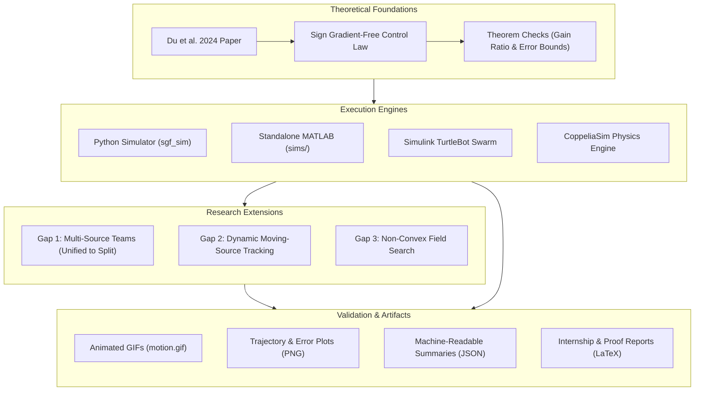

## Simulation Showcase

Key simulation animations and validation plots across robot models and research extensions:

### 1. Multi-Source Swarm Splitting (Gap 1: 9 Robots, 3 Sources)

Autonomous transition from a single unified circular formation to 3 distributed teams ($n_k = 3$) localizing separate unknown source locations.

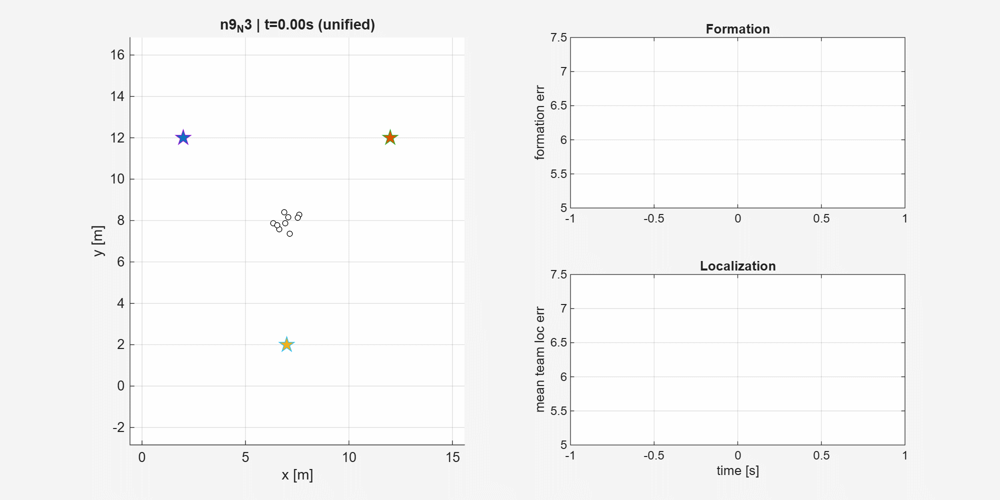

- **Scenario**: 9 robots start in a single cluster, form an initial ring around the virtual source centroid, then split at $t = 12$ s upon detecting multiple spatial minima.
- **Outcome**: All three teams achieve stable circular formations around their respective sources with final localization errors well within the theoretical bound ($\varepsilon = 0.1$).

---

### 2. Dynamic Moving-Source Tracking (Gap 2)

Swarm maintaining a rigid circular formation while tracking a non-stationary source $p_s(t)$ with bounded steady-state lag.

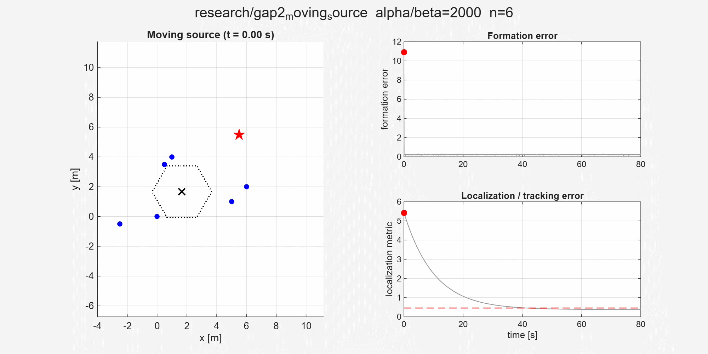

- **Scenario**: 6-robot swarm pursuing a moving target with velocity $v_s = [0.03, 0.02]$ m/s.
- **Outcome**: Swarm establishes circular surrounding formation while centroid tracks the moving source trajectory with an Input-to-State Stable (ISS) bounded lag.

---

### 3. Unicycle Swarm with Heading Vectors & Boundary-Layer Control

Feedback-linearized unicycles with heading vector visualization and sliding-mode chatter elimination.

| Robot Trajectory & Heading | Localization Error Decay |
| :---: | :---: |
| 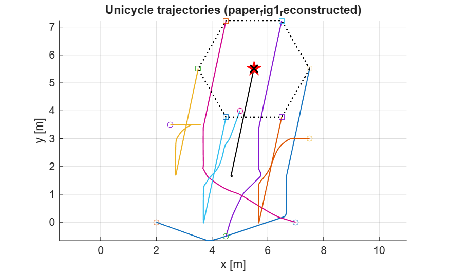 | 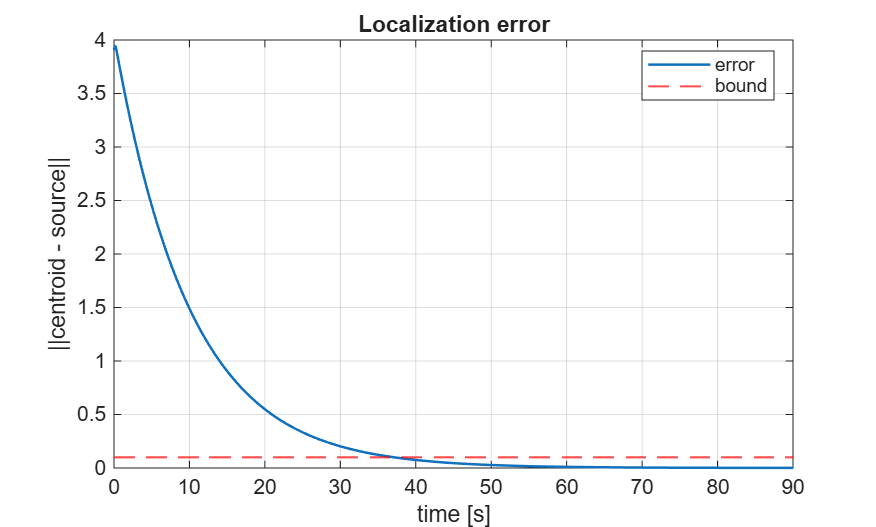 |

- **Scenario**: 6 differential unicycle robots under point-offset feedback linearization ($r = 2.0$ m).
- **Outcome**: Boundary-layer saturation ($\varepsilon_{\text{bl}} = 0.2$) removes high-frequency heading chattering, allowing convergence inside the theoretical bound $\varepsilon = 0.1$.

---

### 4. Differential-Drive TurtleBot Swarm (Simulink & Numerical)

Full differential-drive kinematics with wheel velocity limits and realistic actuator dynamics.

| TurtleBot Swarm Trajectory | Formation Error Series |
| :---: | :---: |
| 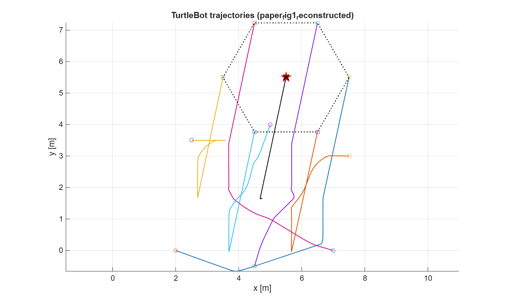 | 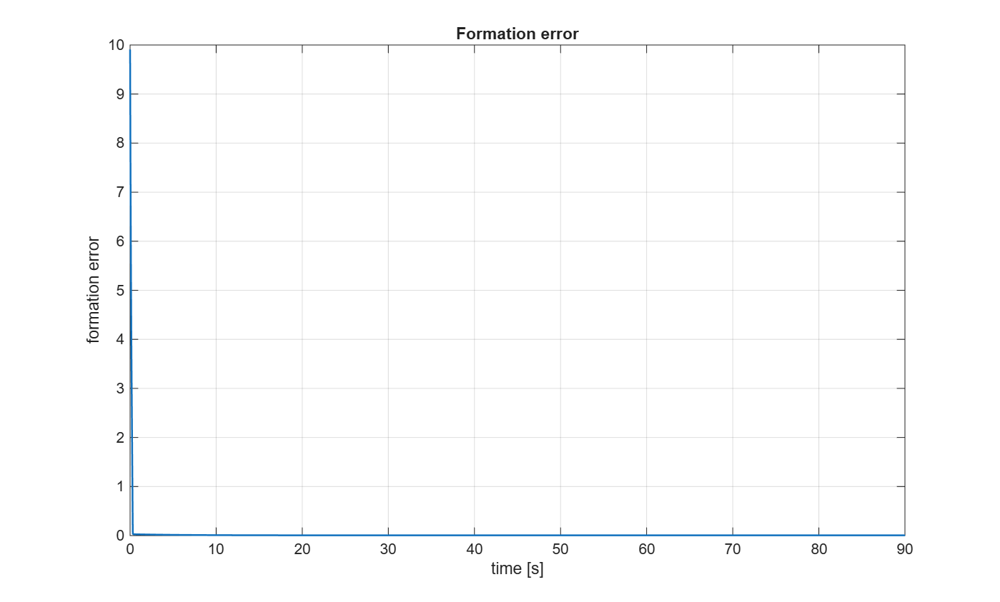 |

- **Scenario**: 6 TurtleBot robots with differential wheel control, tested across numerical Euler and Simulink `ode4` solvers.
- **Outcome**: Accurate formation acquisition and source localization under kinematic constraints.

---

### 5. Canonical Paper Reproduction (Single-Integrator Baseline)

Benchmark validation of Du et al. (2024) Section IV point-robot formulation.

| Formation Trajectory | Localization Error vs Bound |
| :---: | :---: |
| 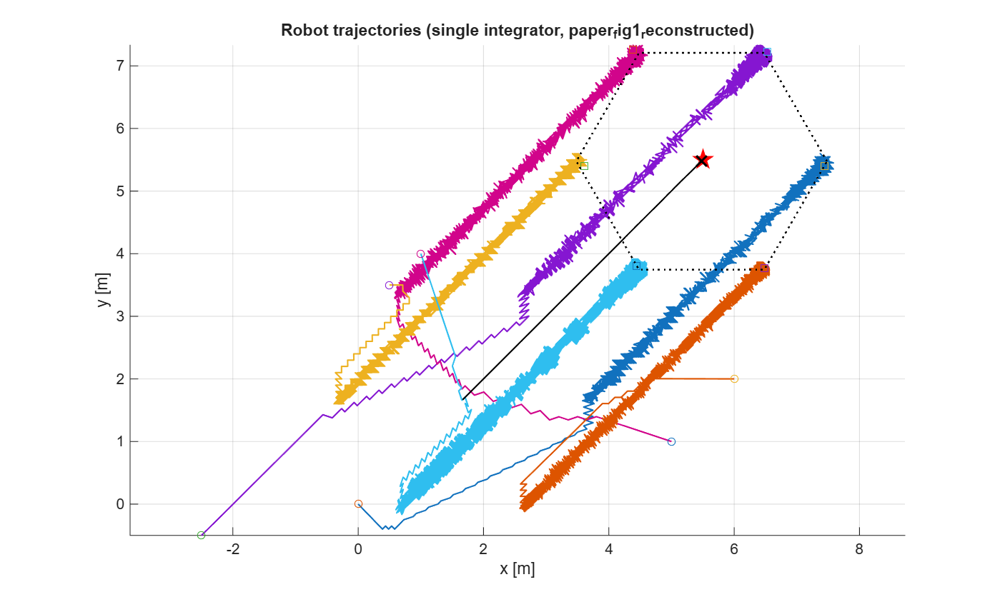 | 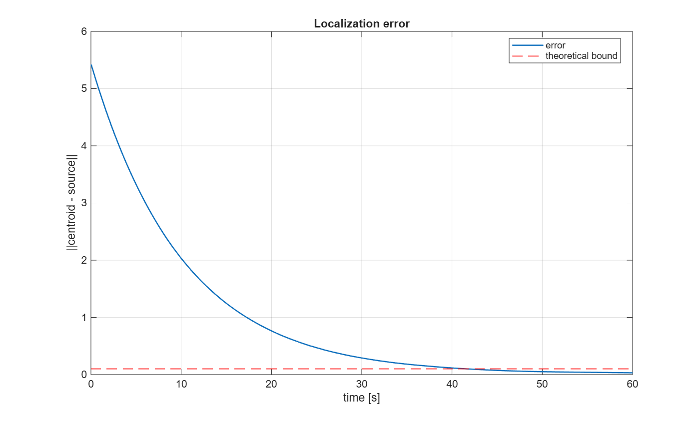 |

- **Scenario**: 6 single-integrator robots with quadratic source field and bounded noise.
- **Outcome**: Exact verification of the sufficient gain condition ($\alpha/\beta = 2000 > 1730.4$) and localization error bound ($\varepsilon = 0.1$).

---

### 6. Non-Convex Potential Field Search (Gap 3)

Swarm behavior in scalar fields with multiple local maxima and saddle points.

| Multi-Modal Field Trajectory | Convergence & Trapping Analysis |
| :---: | :---: |
| 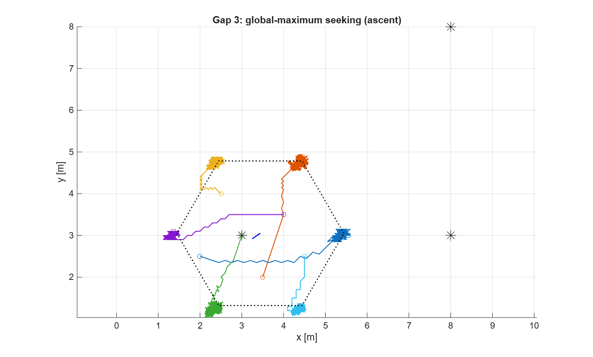 | 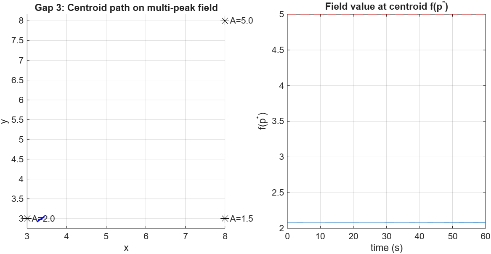 |

- **Scenario**: Scalar potential field containing multiple local extrema, testing convergence and basin of attraction properties.
- **Outcome**: Swarm avoids divergence, forms circular formation around local potential well, demonstrating need for multi-start or dither mechanisms to guarantee global optimum selection.

## Setup

Use Python 3.11 or newer. The current workspace was verified with Python 3.13.

Required packages:

```powershell
python -m pip install numpy matplotlib pytest
```

## Commands

Run a paper-like Gaussian-noise simulation:

```powershell
python -m sgf_sim run --noise gaussian --seed 1 --run-id paper_like_gaussian_seed1
```

Run theorem-faithful bounded-noise validation:

```powershell
python -m sgf_sim validate --seed 1
```

Run tests:

```powershell
python -m pytest -p no:hypothesispytest -q
```

The `-p no:hypothesispytest` flag avoids a local environment issue where the installed Hypothesis pytest plugin imports `trio`, which imports a missing `attrs` package during pytest teardown. The project tests themselves do not use Hypothesis.

Run a small radius sweep:

```powershell
python -m sgf_sim sweep --param R --noise bounded
```

## Outputs

Simulation artifacts are written under `outputs/runs/<run_id>/`:

- `trajectory.png`
- `formation_error.png`
- `localization_error.png`
- `summary.json`

`summary.json` records the parameters, gain-ratio check, informed-robot count, theoretical epsilon bound, and final errors.

## Default Paper-Like Parameters

| Parameter | Default | Paper mapping |
|---|---:|---|
| `n` | 6 | Section IV robot count |
| `source` | `[5.5, 5.5]` | Section IV source location |
| `kappa` | 1.0 | `f(z) = ||z - p_s||^2` |
| `radius` | 2.0 | Section IV formation radius |
| `dmax` | 12.0 | Section IV sensing range |
| `noise_std` | 0.2 | Gaussian paper simulation noise |
| `noise_bound` | 0.2 | Bounded-noise theorem validation value |
| `alpha` | 100.0 | Chosen because paper does not publish gains |
| `beta` | 0.05 | Chosen with `alpha / beta = 2000` |
| `dt` | 0.0005 | Small step for sign-control chatter control |

The theorem threshold for the default bounded setup is approximately `1730.4`, so the default ratio `alpha / beta = 2000` passes the sufficient gain condition.

## Validation Meaning

There are two validation modes because the paper and theorem use slightly different noise assumptions:

- `--noise gaussian` matches the paper's reported simulation noise model, but Gaussian noise is not strictly bounded.
- `--noise bounded` matches Assumption 2, so the theorem's ultimate error bound is applicable.

For the default bounded validation run, all robots remain informed, so the theorem bound reduces to the Remark 4 case:

```text
epsilon = delta / (kappa * R) = 0.2 / (1 * 2) = 0.1
```

A successful bounded run should report `inside_bound: true` in `summary.json`. The Gaussian run should be interpreted as paper-similarity evidence, not a strict theorem-bound proof.

## Known Gaps

- Exact gains are not published in the paper.
- The Fig. 1 graph is shown visually, not as a numeric adjacency matrix.
- The numerical integrator is fixed-step Euler, so very large sign gains require a small `dt`.
- This phase does not model unicycle feedback linearization, TurtleBot3 dynamics, communication sampling, packet loss, or CoppeliaSim scenes.

## Next Phases

1. Add author-figure matching experiments once exact or manually reconstructed Fig. 1 topology is available.
2. Add parameter sweeps for `R`, `delta`, `n_informed`, and gain ratio sensitivity.
3. Add unicycle feedback linearization for the Section V TurtleBot3 model.
4. Add CoppeliaSim integration after the numerical simulator is stable and reviewed.

## Why Some Localization Plots Jitter

Late-stage oscillation is expected in this numerical build. The main source is the discontinuous component-wise sign formation term combined with fixed-step Euler integration. Near formation consensus, tiny shifted-state differences repeatedly cross zero, so the sign input flips between `-1`, `0`, and `1`. This creates high-frequency chatter in the formation term, and the centroid localization error inherits a small ripple.

Measurement noise adds seed-to-seed variation, but it is not the dominant cause. A no-noise run still shows a small late-stage ripple. The exported plots show both lines:

- `raw`: lightly drawn downsampled simulation data
- `smoothed`: a 0.25 second moving average for paper-style visual comparison

The summary file records tail-span and tail-standard-deviation metrics for formation and localization errors, so oscillation can be compared numerically across runs.

## Phase 1.1 Paper-Matching Commands

Run the full paper validation preset:

```powershell
python -m sgf_sim validate-paper --seed 1
```

This writes:

- `outputs/runs/paper_validation/gaussian_similarity`
- `outputs/runs/paper_validation/bounded_theorem_check`
- `outputs/runs/paper_validation/paper_validation_summary.json`
- `outputs/runs/paper_validation/README.md`

Run a topology comparison:

```powershell
python -m sgf_sim sweep --param topology --noise bounded
```

Run a gain sweep with a fixed gain ratio:

```powershell
python -m sgf_sim gain-sweep --ratio 2000 --noise gaussian
```

Named topologies:

- `paper_fig1_reconstructed`: visual reconstruction from the paper's Fig. 1 image, used by default
- `default`: earlier connected graph from the first implementation
- `ring`: six-node cycle
- `complete`: all-to-all graph

The paper publishes Fig. 1 as an image rather than a numeric edge list, so `paper_fig1_reconstructed` is documented as a reconstruction, not a guaranteed exact author graph.

## Phase 1.2 Experiment Suites

The Phase 1.2 experiment runner creates aggregate JSON, CSV, and Markdown reports:

```powershell
python -m sgf_sim experiment paper-suite
python -m sgf_sim experiment gain-ratio-sweep
python -m sgf_sim experiment radius-delta-sweep
python -m sgf_sim experiment seed-sweep --seeds 1 2 3 4 5
```

Each suite writes to `outputs/runs/experiments/<suite>/`:

- `summary.json`
- `summary.csv`
- `report.md`

The reports include final errors, theorem-bound status, convergence entry times, time inside the localization threshold after entry, and late-stage jitter spans.

## Phase 1.25 Shared Config Files

Shared JSON configs now live in `configs/` and are documented in `docs/CONFIG_GUIDE.md`.

Run from config:

```powershell
python -m sgf_sim run-config configs/paper_default.json
python -m sgf_sim run-config configs/paper_bounded_validation.json
```

The same JSON shape is intended for MATLAB via `jsondecode` in Phase 1.3. Planned modes such as `unicycle` and `turtlebot_simulink` are already represented in config examples, but Python intentionally blocks them until those runtimes are implemented.
## Phase 1.3 MATLAB Parity

The MATLAB parity layer lives in `matlab/`. It reads the same shared JSON configs as Python, runs the single-integrator Section IV model, exports MATLAB plots, and writes `summary.json` plus `result.mat`.

Run from the repository root in MATLAB:

```matlab
addpath('matlab')
run_from_config('configs/paper_default.json')
run_from_config('configs/paper_bounded_validation.json')
```

Convenience scripts:

```matlab
addpath('matlab')
run_single_simulation
run_paper_validation
```

The MATLAB implementation is meant for workflow parity and control-theory review. Exact equality with Python is not expected for noisy runs because MATLAB and NumPy use different random-number generators. Use `noise.model = "none"` for deterministic controller and integrator comparisons.

## Standalone MATLAB Scripts (self-contained)

Three self-contained scripts live in [`sims/`](sims/). Edit the `%% Configuration` / `%% Parameters` sections, then run:

```matlab
cd sims
SingleIntegrator   % point robots, paper bounded-validation defaults
Unicycle           % feedback-linearized unicycle, working gains + boundary layer
TurtleBot          % differential-drive numeric (default) or Simulink (set runMode)
```

| Script | Dynamics | Default preset | Output folder |
|---|---|---|---|
| `sims/SingleIntegrator.m` | `p_dot = u` | bounded noise, `alpha=100`, `dt=0.0005` | `sims/outputs/SingleIntegrator/` |
| `sims/Unicycle.m` | control-point FL + Euler | bounded, `alpha=10`, `r=2`, `eps_bl=0.2` | `sims/outputs/Unicycle/` |
| `sims/TurtleBot.m` | same as unicycle + wheels; optional Simulink `ode4` | numeric working preset | `sims/outputs/TurtleBot/` |

**Run guide:** [`sims/RUN_GUIDE.md`](sims/RUN_GUIDE.md) documents mode switching, noise cases, parameter presets, and troubleshooting.

`sims/TurtleBot.m` Simulink mode needs Simulink + Stateflow (MATLAB Function blocks). Set `runMode = "simulink"` near the top of the script. Alternative parameters and the pure-`sgn` controller are kept as commented blocks inside each file.

The older modular packages (`matlab/`, `matlab_turtlebot/`) remain available for JSON-config / parity workflows; see [docs/RUNNING_MODES.md](docs/RUNNING_MODES.md).


