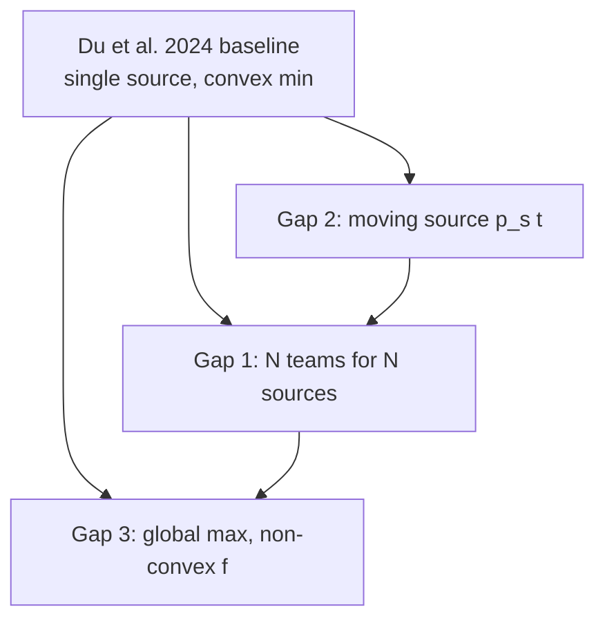
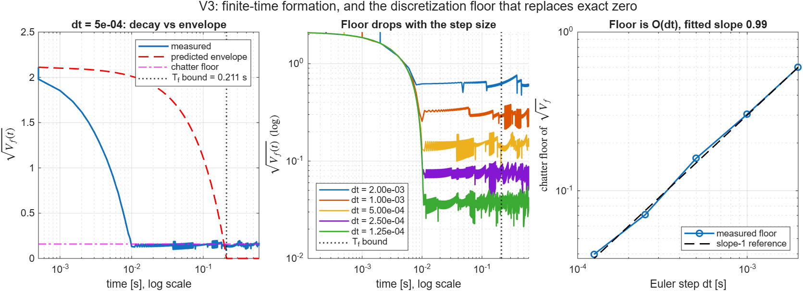
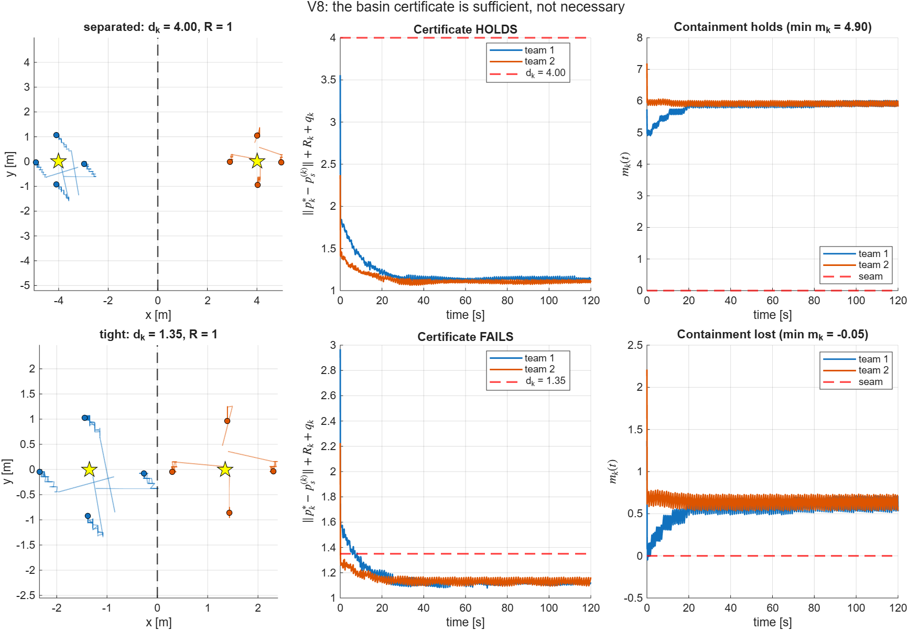
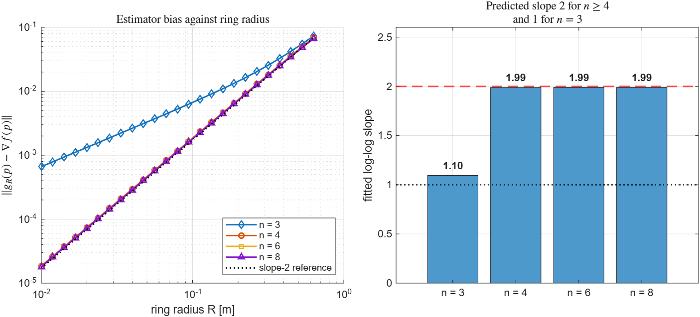

# Research Gaps: Mathematical and Theoretical Framework

Status: **Phase 0 research framing** (pre-theorem, pre-LaTeX proofs).  
Base paper: Du, Chen, Xiang, Guo, Chen, *Simultaneous Source Localization and Formation via a Distributed Sign Gradient-Free Algorithm*, IEEE TCNS, Vol. 11, No. 1, March 2024.

This document frames three open extensions relative to the implemented Du et al. (2024) stack. Each gap names what the current proof assumes, what breaks, a candidate mathematical model, validation metrics, and literature anchors. Simulation validation lives in `sims/research.m`.

---

## 0. Baseline (what the repo implements today)

### Dynamics and control

Single integrator for $n$ robots:

$$
\dot p_i = u_i, \qquad i \in \mathcal{V}=\{1,\ldots,n\}.
$$

Shifted formation coordinates and fixed circular slots:

$$
z_i = p_i - R\,\phi(\theta_i), \quad \theta_i = \frac{2\pi i}{n}, \quad \phi(\theta_i) = [\cos\theta_i,\,\sin\theta_i]^T.
$$

Centroid:

$$
p^*(t) = \frac{1}{n}\sum_{i=1}^n p_i(t).
$$

**Eq. 4** (sign gradient-free controller):

$$
u_i = \alpha \sum_{j\in\mathcal{N}_i} \mathrm{sgn}(z_j - z_i) - \frac{2\beta}{R}\,\sigma(p_i)\,\phi(\theta_i).
$$

### Field and measurement (single static source)

Implemented field (convex quadratic bowl, **one global minimum** at $p_s$):

$$
f(z) = \kappa \|z - p_s\|^2.
$$

Saturated noisy measurement:

$$
\sigma(p_i) =
\begin{cases}
f(p_i) + \eta(p_i), & \|p_i - p_s\| < D_{\max}, \\
f_{D_{\max}} = \kappa D_{\max}^2 + \delta, & \text{otherwise},
\end{cases}
\quad |\eta(p_i)| \le \delta.
$$

### What Theorem 1 guarantees (Stage 2, after formation)

With static $p_s$, undirected connected graph, symmetric slots, and gain ratio $\alpha/\beta > 4n f_{D_{\max}}/R$:

$$
\lim_{t\to\infty}\|p_i - R\phi(\theta_i) - p^*(t)\| = 0, \qquad
\limsup_{t\to\infty}\|p^*(t) - p_s\| \le \varepsilon,
$$

with $\varepsilon = \dfrac{2\pi n \delta}{\kappa R\left(2\pi n_{\mathcal{X}} - n\left|\sin(2\pi n_{\mathcal{X}}/n)\right|\right)}$.

**Standing idealizations:** one source, static landscape, convex $f$, undirected graph, 2D, single integrator.

The three gaps below each violate at least one idealization.

---

## Gap 1: $N$ robots (teams) for $N$ sources at local minima

### Problem statement

Given $N \ge 2$ source locations $\{p_s^{(1)},\ldots,p_s^{(N)}\}\subset\mathbb{R}^2$, each a **local minimum** of a piecewise or multi-basin field, assign the $n$ robots into $N$ teams and run formation-localization so that team $k$ centroid $p_k^*(t)$ converges near $p_s^{(k)}$.

Equal split ($n_k = n/N$) is the symmetric case; unequal splits arise when sources have different importance, sensing quality, or required formation size.

### Why the current proof does not apply

| Broken pillar | Reason |
|---|---|
| P4 (Taylor at $p^*$) | Each team sees a **different** local linearization center. |
| P5 (symmetric sum identities) | Slot indices must be re-indexed **per team**; global $\sum_i \phi(\theta_i)=0$ no longer matches a single centroid field. |
| P6–P7 (blind-robot geometry) | Informed sets $\mathcal{X}^{(k)}$ are source-specific. |
| Single $p_s$ in $V$ | Stage-2 Lyapunov $V=\tfrac12\|p^*-p_s\|^2$ is undefined for multiple targets. |

### Field models with $N$ local minima

**Model A (min-of-quadratics, non-smooth):**

$$
f(z) = \min_{k=1,\ldots,N} \kappa_k \|z - p_s^{(k)}\|^2.
$$

Each $p_s^{(k)}$ is a local minimum in its Voronoi cell $\mathcal{V}_k = \{z : \|z-p_s^{(k)}\| \le \|z-p_s^{(j)}\|\,\forall j\neq k\}$.

**Model B (smooth local wells, used in sim):**

$$
f(z) = -\sum_{k=1}^N A_k \exp\!\left(-\frac{\|z-p_s^{(k)}\|^2}{2\sigma_f^2}\right).
$$

Negating gives peaks; for **minimum-seeking** (source as leak minimum), use Model A or inverted bumps. Model B is useful when testing dual Gap 3 behavior.

**Model C (partitioned quadratic):** each robot $i$ assigned to source index $a_i\in\{1,\ldots,N\}$ and senses

$$
f_{a_i}(z) = \kappa \|z - p_s^{(a_i)}\|^2.
$$

This matches the operational controller extension: run Eq. 4 per robot with its assigned source in $\sigma$ and in the localization push direction.

### Team centroid and per-team formation

Partition $\mathcal{V} = \bigsqcup_{k=1}^N \mathcal{V}_k$ with $|\mathcal{V}_k|=n_k$. For team $k$, re-label robots $i\in\mathcal{V}_k$ with local slots $\theta_i^{(k)} = 2\pi r / n_k$ where $r$ is the local index.

Team centroid:

$$
p_k^*(t) = \frac{1}{n_k}\sum_{i\in\mathcal{V}_k} p_i(t).
$$

**Per-team control (extension of Eq. 4):**

$$
u_i = \alpha \sum_{j\in\mathcal{N}_i\cap\mathcal{V}_k} \mathrm{sgn}(z_j^{(k)} - z_i^{(k)}) - \frac{2\beta}{R}\,\sigma_k(p_i)\,\phi(\theta_i^{(k)}),
\quad i\in\mathcal{V}_k,
$$

where $z_i^{(k)} = p_i - R\phi(\theta_i^{(k)})$ and $\sigma_k$ uses source $p_s^{(k)}$.

Cross-team edges in the communication graph should be **disabled** for formation consensus (otherwise teams pull each other). Inter-team collision avoidance is a separate extension (see `docs/EXTENSION_DIRECTIONS.md`, Direction F).

### Static assignment problem

Given initial positions $\{p_i(0)\}$, choose partition $\mathcal{V}_1,\ldots,\mathcal{V}_N$ to minimize total localization cost:

$$
\min_{\{\mathcal{V}_k\}} \sum_{k=1}^N w_k \,\big\|\bar p_k(0) - p_s^{(k)}\big\|^2,
\quad \bar p_k(0) = \frac{1}{n_k}\sum_{i\in\mathcal{V}_k} p_i(0),
$$

subject to $\sum_k n_k = n$, $n_k \ge n_{\min}$ (minimum team size for circular cancellation, typically $n_k > 2$ from Du et al. Remark on $n>2$).

**Equal split heuristic:** $n_k = n/N$, assign by nearest source (Voronoi partition of robots):

$$
a_i \in \arg\min_k \|p_i(0) - p_s^{(k)}\|.
$$

**Optimal unequal split:** if sources have weights $w_k$, this becomes a capacitated assignment / min-cost transport problem solvable by integer programming or K-means with fixed cluster sizes.

### Candidate theorem sketch (future work)

**Proposition (decomposition, informal).** Suppose:

1. Graph restricted to each $\mathcal{V}_k$ is connected and undirected.
2. $| \mathcal{V}_k | = n_k > 2$ and slots are equally spaced within the team.
3. Gain ratio holds per team with $f_{D_{\max}}^{(k)}$ and $n_k$.
4. Assignment is fixed and each team centroid starts in the basin of $p_s^{(k)}$.

Then each team reproduces Theorem 1 with $(n_k, p_s^{(k)}, \varepsilon_k)$ independently, and

$$
\limsup_{t\to\infty} \|p_k^*(t) - p_s^{(k)}\| \le \varepsilon_k.
$$

**Open issues:** dynamic reassignment when robots cross Voronoi boundaries; shared measurements when $f$ is global not per-source; inter-team communication for consistent field ID.

### Validation metrics (`research.m`, Gap 1)

| Metric | Definition | Pass heuristic |
|---|---|---|
| Per-team localization error | $e_k(t) = \|p_k^*(t) - p_s^{(k)}\|$ | $\limsup e_k < \varepsilon_k + \text{margin}$ |
| Assignment stability | fraction of time $a_i(t)=a_i(0)$ | 1.0 for static assignment |
| Formation error per team | same as Du et al. on $\mathcal{V}_k$ | monotone decrease |
| Total cost | $\sum_k e_k(t)^2$ | compare Voronoi vs random assignment |

### Closest prior work and what it does not cover

Two papers occupy the space adjacent to Gap 1. Neither closes it, and the way they miss is what defines our contribution.

**MESA** — Turgeman and Werner, *Multiple Source Seeking using Glowworm Swarm Optimization and Distributed Gradient Estimation*, ACC 2018 (`docs/research/Multiple_Source_Seeking_using_Glowworm_Swarm_Optimization_and_Distributed_Gradient_Estimation.pdf`).

Closest structural match to Gap 1. Unicycle agents form groups of size $\delta$ and each group settles on one extremum of a multi-modal field. Directly reusable:

| MESA element | Relevance to Gap 1 |
|---|---|
| Sizing rule $N = \delta \cdot \tilde N_\psi$ (agents = group size $\times$ expected extrema) | Exactly our config structure: `n8_N2` $=4\times 2$, `n9_N3` $=3\times 3$, `n12_N3` $=4\times 3$ |
| Match-maker rendezvous points $Q$ for grouping from arbitrary start | Alternative to our clustered start; justifies random deployment |
| Virtual repulsive force when a group nears an already occupied extremum | Prevents two teams collapsing onto one source; needed for dynamic reassignment |
| Source density $p_{\psi_\alpha} = \frac{1}{N}\sum_{i\in\xi_\alpha} e^{-\|\hat r_\alpha - r_i\|}$ and density error $e_{\psi_\alpha}$ | A fairness metric across teams that we currently lack |
| LTL / Büchi automaton for task switching | Formal alternative to our hard-coded $t_{\mathrm{split}}$ |
| Cases $\tilde N_\psi < N_\psi$, $=N_\psi$, $>N_\psi$ | Motivates configs with fewer or more teams than sources |

**What MESA does not do:** it estimates the gradient explicitly by least squares on neighbor measurement differences, $\hat g_i = (R_i^T R_i)^{-1} R_i^T b_i$, requiring $|\mathcal{N}_i| \ge 2$ and full-column-rank $R_i$. Du et al. is deliberately **gradient-free** with ternary $\{-1,0,1\}$ communication, and it carries an explicit steady-state bound $\varepsilon$. MESA has a Lyapunov argument for formation and a density-error bound, but no localization accuracy bound tied to noise. So MESA is a **baseline to compare against**, not a method to adopt wholesale.

**DIAS** — Chen, Kailas, Deolasee, Luo, Sycara, Kim, *Distributed Multi-robot Source Seeking in Unknown Environments with Unknown Number of Sources*, ICRA 2025 ([arXiv:2503.11048](https://arxiv.org/abs/2503.11048)).

Attacks the part Gap 1 currently assumes away: **source locations and source count are unknown**. Directly reusable:

| DIAS element | Relevance to Gap 1 |
|---|---|
| Voronoi tessellation $V_i = \{q : \|q-x_i\| \le \|q-x_j\|\ \forall j\}$ for task allocation | Citation and justification for our assignment step |
| GP regression for the density function $\phi$, posterior $\mu(q), \sigma^2(q)$ | How to locate sources without hard-coding them |
| LCB test $\mu(q) - \beta\sigma^2(q) > \tau$ to declare a candidate source | Concrete, tunable source-detection rule |
| Hybrid controller: exploration (ergodic active sensing) vs exploitation (source seeking) | Principled version of our unified-then-split phase switch |
| Declare found source, broadcast to neighbors to avoid revisits | Same role as MESA's repulsion, via communication instead of force |
| Metrics: iterations to find all sources, WRMSE of estimated density | Better search-efficiency metrics than final error alone |
| Baselines DoSS, GMES, GreedyBO | Ready-made comparison set |

**What DIAS does not do:** robots act individually (3 robots, 3 to 7 sources). There is **no formation control**, no circular surround, no analytical error bound, and it needs full scalar measurements plus GP inference rather than sign-only exchange. It solves discovery, not team-based surround-and-localize.

### Positioning of Gap 1

| Capability | Du et al. 2024 | MESA 2018 | DIAS 2025 | Gap 1 target |
|---|---|---|---|---|
| Circular formation around target | yes | yes (diamond) | no | yes |
| Multiple sources / extrema | no | yes | yes | yes |
| Gradient-free, sign-only comms | yes | no (LS gradient) | no (GP) | yes |
| Explicit steady-state error bound | yes ($\varepsilon$) | density error only | no | yes (per-team $\varepsilon_k$) |
| Unknown source count | no | partially ($\tilde N_\psi$ guess) | yes | future |

The unoccupied cell is **sign gradient-free, ternary-communication, multi-team formation seeking with per-team $\varepsilon_k$ bounds**. That is a defensible contribution, and both papers are the right things to cite as the nearest neighbors.

### Concrete items to pull in

1. **Per-team fairness metric** (from MESA): report source density $p_{\psi_k}$ and density error $e_{\psi_k}$ alongside $e_k(t)$, so "all teams did equally well" is measurable, not just "each team converged".
2. **Occupancy repulsion** (from MESA and DIAS): required before dynamic reassignment is safe, otherwise two teams can lock onto the same source.
3. **Unequal team counts** (from MESA): add configs with $\tilde N_\psi \ne N_\psi$, since our three configs all assume teams $=$ sources.
4. **GP + LCB source discovery** (from DIAS): the natural next step that removes the "sources known a priori" assumption. This is a separate sub-gap; keep it after the fixed-source proof lands.
5. **Search-efficiency metrics** (from DIAS): time to first contact per source, and total iterations to cover all sources.

### Literature anchors

- Du et al. (2024): baseline Eq. 4 and symmetric cancellation.
- Turgeman and Werner, *Multiple source seeking using GSO and distributed gradient estimation*, ACC 2018: group-per-extremum with formation, density fairness metric, LTL switching. Gradient-based, so a baseline rather than a component.
- Chen et al., *Distributed multi-robot source seeking in unknown environments with unknown number of sources* (DIAS), ICRA 2025: Voronoi allocation, GP density estimation, LCB source identification, exploration/exploitation switching. No formation control.
- Krishnanand and Ghose, *Glowworm swarm optimization for simultaneous capture of multiple local optima*, Swarm Intelligence 2009: the GSO primitive MESA builds on; multi-optima capture by luciferin attraction.
- Cortés, Martínez, Karatas, Bullo, *Coverage control for mobile sensing networks*, IEEE TAC 2004: Voronoi partitions for multi-target deployment (different control, same assignment geometry).
- Olfati-Saber, *Flocking for multi-agent dynamic systems*, IEEE TAC 2006: formation + consensus decomposition patterns.
- Chen, Ren, Cao, *Surrounding control in cooperative agent networks*, IEEE TCNS 2017 (Remark 7 in Du et al.): balanced formations for higher dimensions.
- Du, Qian, Iqbal, Claudel, Sun, *Multi-robot dynamical source seeking in unknown environments* (DoSS), ICRA 2021: DIAS baseline, distributed multi-source seeking.
- Ma, Zhang, Wu, Calmon, Li, *Gaussian max-value entropy search for multi-agent Bayesian optimization* (GMES), IROS 2023: DIAS baseline.

---

## Gap 2: Moving (non-stationary) source $p_s(t)$

### Problem statement

The source trajectory $p_s(t)$ is time-varying with bounded velocity $\|\dot p_s(t)\|\le v_{\max}$. The swarm should keep $\|p^*(t)-p_s(t)\|$ uniformly ultimately bounded, ideally with a tracking error proportional to $v_{\max}$ and the noise bound $\delta$.

Du et al. **explicitly list time-varying sources as future work** (Conclusion; see `docs/EXTENSION_DIRECTIONS.md`, Direction B).

### Why the current proof breaks

Stage-2 Lyapunov $V(t)=\tfrac12\|p^*(t)-p_s\|^2$ assumes $\dot p_s=0$. With moving source:

$$
\dot V = (p^* - p_s)^T(\dot p^* - \dot p_s).
$$

The term $-(p^*-p_s)^T\dot p_s$ is a **persistent disturbance** even if $\dot p^*$ drives $V$ negative. Pillars P6 (static geometry for blind robots) and P7 (steady-state $\varepsilon$) fail.

### Tracking error dynamics (first-order sketch)

After formation time $T_c$, use the paper's Stage-2 approximation (Eq. 14–16):

$$
\dot p^* \approx -\beta \nabla f(p^*) + d_f(t),
$$

where $d_f$ collects formation residual and noise. For $f(z)=\kappa\|z-p_s(t)\|^2$:

$$
\nabla f(p^*) = 2\kappa(p^* - p_s(t)), \qquad
\dot p^* \approx -2\beta\kappa (p^* - p_s(t)) + d_f - \underbrace{2\beta\kappa \dot p_s \cdot \tau}_{\text{lag term}} \text{ (informal)}.
$$

More cleanly, define tracking error $e(t) = p^*(t) - p_s(t)$:

$$
\dot e = \dot p^* - \dot p_s \approx -2\beta\kappa e - \dot p_s + d_f.
$$

This is a **linear ISS system** driven by $\dot p_s$ and $d_f$.

### Candidate ISS theorem sketch

Consider

$$
\dot e = -\lambda e + w(t), \quad \lambda = 2\beta\kappa > 0, \quad \|w(t)\| \le v_{\max} + \bar d_f,
$$

where $\bar d_f$ bounds formation/noise residuals. Standard ISS yields:

$$
\limsup_{t\to\infty} \|e(t)\| \le \frac{v_{\max} + \bar d_f}{\lambda} + \varepsilon_{\mathrm{static}},
$$

with $\varepsilon_{\mathrm{static}}$ the Du et al. bound for $\dot p_s=0$.

**Design implication:** increase $\beta$ (or $\kappa$ if field is tunable) to reduce tracking lag; maintain $\alpha/\beta$ above threshold so formation still converges.

### Source trajectory classes to validate

| Class | Model | Expected behavior |
|---|---|---|
| Constant velocity | $p_s(t) = p_{s0} + v t$ | steady-state offset $\|e\|\approx \|v\|/(2\beta\kappa)$ plus $\varepsilon$ |
| Circular | $p_s(t) = c + r[\cos(\omega t),\sin(\omega t)]^T$ | phase lag; bound grows with $r\omega$ |
| Step hold | piecewise constant velocity | transient after each velocity change |

### Validation metrics (`research.m`, Gap 2)

| Metric | Definition |
|---|---|
| Instantaneous tracking error | $e(t)=\|p^*(t)-p_s(t)\|$ |
| Peak error | $\max_t e(t)$ |
| Steady-state mean error | mean of $e(t)$ over last 25% of horizon |
| Lag estimate | cross-correlation lag between $p^*$ and $p_s$ paths |

### Literature anchors

- Du et al. (2024): static-source assumption and Conclusion future work.
- Khalil, *Nonlinear Systems*: ISS definitions and cascade theorems.
- Dochain, Panizza, *Adaptive extremum seeking*, Automatica 2000: tracking moving extrema.
- `docs/EXTENSION_DIRECTIONS.md` Direction B: full proof-gap analysis and validation tiers.

---

## Gap 3: Avoiding local minima to reach the global maximum

### Problem statement

Suppose the scalar field has **multiple extrema**. The application requires finding the **global maximum** $p_{\mathrm{glob}} = \arg\max_{z} f(z)$, not settling at a suboptimal peak or trapped in a valley.

Du et al. seek a **minimum** of a **convex** $f$, so local minima do not exist in the baseline model. Gap 3 introduces **non-convex** $f$ and asks for **global extremum selection**.

### Clarifying minimum vs maximum seeking

| Goal | Field transform | Du et al. localization term |
|---|---|---|
| Find minimum (baseline) | $f$ convex, min at $p_s$ | $-\frac{2\beta}{R}\sigma\phi$ (descent on $f$) |
| Find maximum | work on $g(z)=-f(z)$ or flip sign | $+\frac{2\beta}{R}\sigma\phi$ (ascent on $f$) |

For multi-peak $f$:

$$
f(z) = \sum_{k=1}^M A_k \exp\!\left(-\frac{\|z-c_k\|^2}{2\sigma_f^2}\right), \quad A_1 > A_2 \ge \cdots \ge A_M > 0.
$$

Global maximum at $c_1$ (largest amplitude). Local maxima at smaller $c_k$. **Saddle and valley** regions exist between peaks; gradient-free sign methods can stall where $\|\nabla f\|$ is small but $p^*$ is far from $c_1$.

### Why sign gradient-free seeking gets trapped

After formation, the paper approximates the centroid drift as $-\beta \nabla f(p^*)$. For non-convex $f$:

1. **Basin of attraction:** $p^*(0)$ near $c_j$ flows to $c_j$, not $c_1$.
2. **Measurement saturation:** outside $D_{\max}$ of all peaks, $\sigma_i = f_{D_{\max}}$ constant; localization term loses directional information.
3. **No inter-swarm repulsion:** a single swarm has no incentive to leave a local peak.

These are **not bugs** in the implementation; they are structural limits of single-swarm gradient-free ascent on non-convex landscapes.

### Candidate escape mechanisms (to prove and validate one-by-one)

**Mechanism 1: Dither / periodic perturbation (extremum seeking).**

Add $\rho \sin(\omega t)\,\phi(\theta_i)$ to the localization channel or modulate $\beta(t)=\beta_0+\rho\sin(\omega t)$. Classical ES (Krishnamurthy & Tan) extracts gradient information at small scale; may escape shallow traps.

**Mechanism 2: Multi-swarm repartition (links to Gap 1).**

$N$ swarms with $N$ assigned peaks; restart assignment when $\sigma$ ranking changes. Combines Voronoi assignment with amplitude comparison.

**Mechanism 3: Stochastic perturbation.**

Bounded noise on control input or measurement; almost-sure escape from shallow wells (simulated annealing viewpoint), at cost of steady-state variance.

**Mechanism 4: Hierarchical time-scale.**

Slowly increase exploration gain when $\|\dot p^*\|$ falls below threshold (stagnation detection), then restore $\beta$ after leaving plateau.

### Candidate theorem sketch (weakest form)

For a field with isolated maxima $\{c_k\}$ and strict separation, suppose Mechanism 2 assigns one swarm per peak and $A_1$ is unique maximum. If each swarm satisfies Du et al. on $g_k(z)=-f(z)$ within its basin, the swarm assigned to $c_1$ achieves $\|p_1^*-c_1\|\le\varepsilon_1$; **global optimality** reduces to **correct assignment** of the largest-amplitude peak to a sufficiently large team.

Full escape from wrong basin without reassignment requires additional assumptions (dither amplitude vs barrier height); this is an open extremum-seeking problem.

### Validation metrics (`research.m`, Gap 3)

| Metric | Definition | Interpretation |
|---|---|---|
| Peak index reached | $\arg\max_k A_k$ such that $\|p^*-c_k\|<R_0$ | 1 = global max found |
| Stagnation time | time with $\|\dot p^*\|<\epsilon$ before escape | lower is better |
| Final $f(p^*)$ | field value at centroid | compare to $f(c_1)$ |
| Success rate | over random initial conditions | Monte Carlo over seeds |

### Literature anchors

- Tan, Li, Moss, *Extremum seeking*, IEEE Control Systems Magazine 2014.
- Krishnamurthy & Tan, *Harmonic excitation in extremum seeking*, Automatica 2019.
- Ghods & Krstic, *Multiagent deployment over a source*, IEEE TCNS 2014: multi-agent source seeking (PDE fields).
- Matveev, Wang, Savkin, *Real-time navigation in unknown environments*, IEEE TAC 2014: barrier functions and local minima in navigation (analogous traps).

---

## Cross-gap dependency map



- Gap 1 + Gap 3: multiple swarms assigned to peaks implements global max when $A_k$ are known or estimated.
- Gap 2 + Gap 1: moving sources require per-team ISS tracking bounds.

---

## Recommended research sequence

1. **Gap 2 (moving source):** smallest change to Eq. 4; empirical ISS bounds before formal proof.
2. **Gap 1 (multi-source assignment):** static Voronoi partition; per-team Theorem 1 decomposition.
3. **Gap 3 (global maximum):** define non-convex $f$; document failure modes; then test escape mechanisms.

Each step should produce:

- Updated `sims/research.m` experiment with JSON summary.
- LaTeX section in `docs/research/research_gaps.tex`.
- Theorem/proposition with explicit assumptions listed against pillars P1–P7.

---

## Graphical verification of the analytical claims

`sims/verify_theory.m` turns every load-bearing lemma, theorem, and identity into a plot that compares a measured quantity against what the theory predicts. Each check is a falsification attempt, not a demonstration: it is designed so that a wrong claim would produce a visibly wrong curve.

```matlab
cd sims
verify_theory              % all 12 checks
verify_theory baseline     % v1..v6
verify_theory gap1         % v7, v8
verify_theory gap2         % v9
verify_theory gap3         % v10, v11, v12
verify_theory v10          % a single check
```

Outputs land in `sims/outputs/verify_theory/`: one PNG per check plus `summary.json` with the verdict and the numbers behind it. Full suite runtime is about two and a half minutes.

| ID | Claim | Outcome |
|---|---|---|
| V1 | Polygon identities | Exact for $n\ge4$; third moment is $0.453$ at $n=3$ |
| V2 | Connectivity bound | 600/600 random graphs respect both inequalities |
| V3 | Finite-time formation | Settles two decades before the bound; chatter floor is $O(\Delta t^{0.99})$ |
| V4 | Exact gradient identity | Machine precision for the quadratic field, visibly nonzero for a Gaussian |
| V5 | All-informed bound | Worst tail error $0.0148$ against a bound of $0.05$ |
| V6 | $\varepsilon$ and $\lambda_\mathcal{X}$ consistency | Product constant to $1.7\times10^{-16}$ |
| V7 | Team-size cancellation | $\varepsilon_k$ flat in $n_k$ to $5.6\times10^{-16}$ |
| V8 | Basin certificate | Sufficiency respected; tight spacing genuinely loses containment |
| V9 | Moving-source lag | Lag vector matches to $2.3\%$, speed sweep slope to $5\%$ |
| V10 | Estimator bias | Fitted slopes $1.10$ at $n=3$, $1.99$ at $n\ge4$ |
| V11 | Local trapping | Suboptimal basins cover $60\%$ of the domain |
| V12 | Multi-start selection | $100\%$ accuracy inside the guaranteed region |

### The three checks that changed something

**V3 exposed a measurement floor.** The continuous-time claim is convergence to exactly zero, but fixed-step Euler chatters at a level proportional to $\alpha\,\Delta t$. Sweeping the step size confirms the floor is $O(\Delta t)$ with a fitted exponent of $0.99$. Any formation error reported below roughly $\alpha\,\Delta t$ is a discretization artefact. At the default `research.m` settings ($\alpha=100$, $\Delta t=5\times10^{-4}$) that floor is around $0.15$, which is not negligible.



**V8 showed the basin certificate is not a formality.** With sources at $x=\pm4$ the certificate holds and the Voronoi margin never drops below $4.90$. With sources at $x=\pm1.35$, where the ring radius alone nearly exhausts the clearance, the certificate fails and containment is actually lost, $\min_t m_k = -0.05$. Sufficiency is never violated, and the tight case proves the condition discriminates.



**V10 isolated what the $n\ge4$ hypothesis buys.** On a Gaussian mixture the $n=3$ ring has fitted slope $1.10$ while $n=4,6,8$ all sit at $1.99$. The gain is a full order in $R$, not a constant factor, and it traces directly to the third-moment identity from V1.



### What the checks do not establish

V6 is pure algebra, so it confirms internal consistency of the imported saturation geometry without providing any independent evidence that the geometry is correct. V5 and V12 both show the bounds are loose: the observed tail error is a third of $\varepsilon_\mathrm{all}$, and multi-start selection is still $98\%$ accurate well outside the guaranteed region. Loose bounds are still correct bounds, but they should not be quoted as predictions of observed behaviour.

None of this closes the conditional status of Gap 1. V8 tests the certificate; it does not prove the controller enforces it.

## Simulation entry point

```matlab
cd sims
research          % runs all three gap validations
research gap2     % optional: single gap from command line
verify_theory     % graphical verification of the analytical claims
```

Outputs: `sims/outputs/research/gap1/`, `gap2/`, `gap3/` with plots, `summary.json`, `result.mat`, and `sims/outputs/verify_theory/` for the verification figures.

See `docs/research/research_gaps.tex` for the formal write-up, where each figure is placed beside the claim it verifies.
