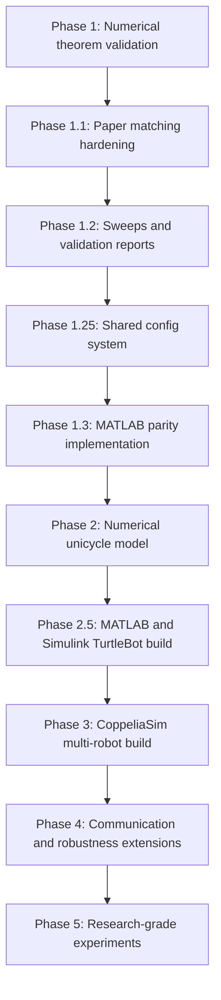

# Project Roadmap: Sign Gradient-Free Source Localization and Formation

This roadmap defines the planned builds for reproducing and extending **Simultaneous Source Localization and Formation via a Distributed Sign Gradient-Free Algorithm** by Du et al., IEEE TCNS 2024.

The project goal is to build a trustworthy simulation pipeline that first validates the paper's numerical theory, then moves toward more realistic robot dynamics, and finally reaches CoppeliaSim-based multi-robot simulation.



## Phase 1: Numerical Theorem Validation

**Status:** implemented.

**Purpose:** Build the pure numerical Section IV simulator before adding robot physics or CoppeliaSim complexity.

**Scope:**

- Single-integrator robot model: `p_dot_i = u_i`
- Quadratic source field: `f(z) = kappa * ||z - p_s||^2`
- Measurement saturation through `Dmax`
- Gaussian noise for paper-like runs
- Bounded noise for theorem-faithful runs
- Eq. 4 sign gradient-free control law
- Formation error and localization error plots
- Theorem gain and epsilon-bound checks

**Main commands:**

```powershell
python -m sgf_sim run --noise gaussian --seed 1
python -m sgf_sim validate --seed 1
python -m pytest -p no:hypothesispytest -q
```

**Acceptance criteria:**

- Simulation runs without numerical failure.
- Gain condition is computed and reported.
- Bounded-noise run reports whether final localization error is inside the theorem bound.
- Formation and localization errors decrease under default settings.

## Phase 1.1: Paper-Matching Validation Hardening

**Status:** implemented.

**Purpose:** Make the numerical reproduction closer to the paper's Section IV figures and expose the paper gaps clearly.

**Scope:**

- Named topology presets:
  - `paper_fig1_reconstructed`
  - `default`
  - `ring`
  - `complete`
- Reconstructed Fig. 1 topology from the paper image.
- Paper validation preset with both Gaussian and bounded-noise runs.
- Markdown validation reports per run.
- Jitter metrics in `summary.json`.
- Smoothed plot overlays for paper-style visual comparison while preserving raw data.

**Main commands:**

```powershell
python -m sgf_sim validate-paper --seed 1
python -m sgf_sim sweep --param topology --noise bounded
python -m sgf_sim gain-sweep --ratio 2000 --noise gaussian
```

**Acceptance criteria:**

- `validate-paper` creates Gaussian similarity and bounded theorem-check outputs.
- Bounded theorem-check run stays inside the epsilon bound.
- Reports document topology, gain ratio, error metrics, and interpretation.
- The reconstructed topology is labeled as a reconstruction, not claimed as exact author data.

## Phase 1.2: Parameter Sweeps and Scientific Reporting

**Status:** implemented.

**Purpose:** Turn the simulator from a one-run validator into a repeatable experiment system.

**Scope:**

- Add broader sweeps for:
  - `R`
  - `delta`
  - `beta`
  - gain ratio `alpha / beta`
  - topology
  - random seeds
- Add convergence-time metrics:
  - first time formation error drops below a threshold
  - first time localization error enters epsilon bound
  - time spent inside bound after entry
- Add aggregate reports:
  - CSV summary
  - JSON summary
  - Markdown report with tables
  - optional combined plot grids
- Add paper-style preset comparison table:
  - Gaussian similarity result
  - bounded theorem result
  - topology sensitivity
  - gain sensitivity

**Proposed commands:**

```powershell
python -m sgf_sim experiment paper-suite
python -m sgf_sim experiment gain-ratio-sweep
python -m sgf_sim experiment radius-delta-sweep
python -m sgf_sim experiment seed-sweep --seeds 1 2 3 4 5
```

**Acceptance criteria:**

- Each experiment writes one self-contained output folder.
- Each folder includes plots, `summary.json`, `summary.csv`, and `report.md`.
- Sweep results show whether the theorem trends hold:
  - larger `R` should reduce epsilon
  - larger `delta` should increase epsilon
  - all-informed case should match `epsilon = delta / (kappa * R)`
- Results distinguish theorem-valid bounded-noise runs from paper-like Gaussian runs.


## Phase 1.25: Shared Config System

**Status:** implemented.

**Purpose:** Add one human-readable parameter file format that both Python and MATLAB can use. Changing values in this file should be enough to test different modes, topologies, gains, source fields, robot models, and output settings.

The preferred format is JSON because Python can parse it natively and MATLAB can read it with `jsondecode`. YAML is more readable, but MATLAB support is less standard without extra tooling.

**Proposed shared config file:**

```text
configs/
  paper_default.json
  paper_bounded_validation.json
  unicycle_default.json
  turtlebot_simulink_default.json
```

**Required config sections:**

```json
{
  "experiment": {
    "name": "paper_default",
    "mode": "single_integrator",
    "seed": 1,
    "duration": 60.0,
    "dt": 0.0005
  },
  "paper_parameters": {
    "n": 6,
    "source": [5.5, 5.5],
    "kappa": 1.0,
    "R": 2.0,
    "Dmax": 12.0,
    "alpha": 100.0,
    "beta": 0.05
  },
  "noise": {
    "model": "gaussian",
    "std": 0.2,
    "bound": 0.2
  },
  "topology": {
    "name": "paper_fig1_reconstructed",
    "adjacency": null,
    "edges": [[0, 1], [0, 2], [0, 5], [1, 2], [1, 4], [2, 3], [3, 4], [4, 5]]
  },
  "robot_model": {
    "type": "single_integrator",
    "unicycle_shift_r": 0.025,
    "max_linear_velocity": null,
    "max_angular_velocity": null
  },
  "outputs": {
    "folder": "outputs/runs",
    "save_plots": true,
    "save_animation": true,
    "animation_format": "gif",
    "animation_fps": 20,
    "show_error_panels": true
  }
}
```

**Mode values to support:**

- `single_integrator`
- `unicycle`
- `turtlebot_numeric`
- `turtlebot_simulink`
- `coppelia`

**Acceptance criteria:**

- Python CLI can run from a config file:

```powershell
python -m sgf_sim run-config configs/paper_default.json
```

- MATLAB can run from the same config file:

```matlab
run_from_config('configs/paper_default.json')
```

- The config file contains comments through a companion `CONFIG_GUIDE.md`, because JSON itself does not allow comments.
- Every field has a documented meaning, units, default, and paper reference when applicable.
- Direct CLI flags may override config values, but the config file remains the source of truth for reproducible experiments.


## Phase 1.3: MATLAB Parity Implementation

**Status:** implemented.

**Purpose:** Add a MATLAB implementation path because the extraction notes identify MATLAB or Simulink as the likely original toolchain for the paper's Section IV numerical simulation.

This phase should not replace the Python simulator. It should provide a MATLAB-compatible reproduction layer for closer control-theory workflow parity and easier comparison with how the authors likely generated Figs. 2-4.

**Scope:**

- Create a `matlab/` folder with a script-based implementation.
- Implement the same Section IV model used by the Python simulator:
  - single-integrator robot dynamics
  - Eq. 4 sign gradient-free control law
  - paper-like Gaussian noise
  - bounded noise for theorem-faithful validation
  - reconstructed Fig. 1 topology option
  - formation and localization error curves
- Keep parameter names aligned with the Python config where possible:
  - `n`
  - `ps`
  - `kappa`
  - `R`
  - `Dmax`
  - `alpha`
  - `beta`
  - `dt`
  - `duration`
  - `noise_model`
- Export comparable artifacts:
  - trajectory figure
  - formation error figure
  - localization error figure
  - animated GIF or MP4 showing robot motion
  - synchronized animation panels for formation error and localization error
  - `summary.json` or `.mat` result file
- Add a MATLAB README with exact run commands.

**Proposed structure:**

```text
matlab/
  README.md
  run_paper_validation.m
  run_single_simulation.m
  sgf_config.m
  sgf_control.m
  sgf_measurement.m
  sgf_theory_bounds.m
  sgf_topology.m
  sgf_plot_results.m
```

**Proposed MATLAB commands:**

```matlab
run_paper_validation
run_single_simulation
```

**Acceptance criteria:**

- MATLAB run reproduces the same qualitative behavior as the Python run.
- MATLAB bounded-noise run computes epsilon and reports whether final localization error is inside the bound.
- MATLAB Gaussian run provides a paper-style visual comparison.
- Python and MATLAB outputs agree within documented numerical tolerance for the same seed, topology, gains, and integration step.
- Any mismatch caused by random-number generators or plotting differences is documented.

## Phase 2: Numerical Unicycle Model

**Status:** implemented.

**Purpose:** Add the Section V robot kinematics while staying in fast numerical simulation.

**Scope:**

- Implement unicycle state:
  - `x_i`
  - `y_i`
  - heading `theta_i`
- Implement feedback linearization using shifted control point:
  - `s_i = p_i + r [cos(theta_i), sin(theta_i)]`
  - convert single-integrator command `f_i` into `(v_i, omega_i)`
- Add robot command limits:
  - max linear velocity
  - max angular velocity
- Add sampled communication period option, defaulting to Section V value `T = 0.1 s`.
- Compare single-integrator and unicycle outputs under similar initial conditions.

**Proposed commands:**

```powershell
python -m sgf_sim unicycle run --seed 1
python -m sgf_sim unicycle validate --seed 1
python -m sgf_sim unicycle compare-single-integrator --seed 1
```

**Acceptance criteria:**

- Unicycle simulation reaches a circular formation and localizes near the source.
- Feedback-linearization shift radius `r` is positive and validated.
- Commands remain finite and respect configured velocity limits.
- Reports compare unicycle behavior against the Phase 1 single-integrator baseline.


## Phase 2.5: MATLAB and Simulink TurtleBot Build

**Status:** implemented.

**Purpose:** Add a TurtleBot-oriented MATLAB/Simulink implementation path before CoppeliaSim. This gives a controls-friendly bridge from the numerical unicycle model to a block-diagram workflow that can later connect to robotics simulators or hardware-style models.

**Scope:**

- Create MATLAB scripts and Simulink models for TurtleBot-style differential-drive robots.
- Use the same shared JSON config files as Python and MATLAB numerical runs.
- Implement the unicycle feedback-linearization controller from the paper.
- Include TurtleBot parameters:
  - wheel radius
  - wheel separation
  - maximum linear velocity
  - maximum angular velocity
  - command update period
  - optional actuator saturation
- Build a Simulink model for:
  - multi-robot state update
  - sign-based neighbor communication
  - source measurement model
  - controller block
  - error metric computation
- Add animation export from MATLAB or Simulink logs.

**Animated output requirement:**

The TurtleBot MATLAB/Simulink run should export a GIF or MP4 with synchronized panels:

```text
+-----------------------------+-----------------------------+
| Robot formation and source  | Formation error vs time     |
| Robot trails and centroid   | Localization error vs time  |
+-----------------------------+-----------------------------+
```

The animation should show:

- robot positions and headings
- final circular formation target
- source location
- centroid path
- live formation error curve
- live localization error curve
- current simulation time
- gain ratio and topology name as small metadata text

**Proposed structure:**

```text
matlab_turtlebot/
  README.md
  run_turtlebot_simulation.m
  run_turtlebot_from_config.m
  export_turtlebot_animation.m
  models/
    sgf_turtlebot_swarm.slx
  helpers/
    turtlebot_params.m
    unicycle_feedback_linearization.m
    differential_drive_step.m
```

**Proposed commands:**

```matlab
run_turtlebot_from_config('../configs/turtlebot_simulink_default.json')
run_turtlebot_simulation
```

**Acceptance criteria:**

- The Simulink or MATLAB TurtleBot run reaches the source neighborhood under paper-like conditions.
- The exported animation shows robot motion and both error plots simultaneously.
- The run writes the same core metrics as Python:
  - final formation error
  - final localization error
  - epsilon bound
  - inside-bound status where applicable
  - jitter statistics
- Results are compared against Phase 2 numerical unicycle outputs.
- Any differences caused by actuator saturation, step size, or Simulink solver choice are documented.


## Phase 3: CoppeliaSim Multi-Robot Build

**Status:** planned for later.

**Purpose:** Move from numerical kinematics into a visual physics/simulator environment.

**Scope:**

- Create a CoppeliaSim scene with six differential-drive robots or simple mobile bases.
- Use Python remote API or ZeroMQ API control loop.
- Read robot poses from simulator ground truth as an OptiTrack-like signal source.
- Apply the Phase 2 unicycle controller to each robot.
- Render source, formation circle, robot trails, and centroid path.
- Export run data in the same summary format used by numerical phases.
- Export a GIF or MP4 with synchronized robot motion, formation error, and localization error panels.

**Proposed structure:**

```text
coppelia/
  scenes/
  controllers/
  README.md
  run_coppelia_experiment.py
```

**Acceptance criteria:**

- Scene launches and robots move under the controller.
- CoppeliaSim run produces trajectory and error data comparable to numerical runs.
- The same `summary.json` metrics are generated.
- Differences between numerical and CoppeliaSim behavior are documented.

## Phase 4: Communication and Robustness Extensions

**Status:** planned extension.

**Purpose:** Explore the future-work directions named by the paper.

**Scope:**

- Directed topologies.
- Delayed communication.
- Packet loss.
- Corrupted or adversarial sign messages.
- Time-varying source position.
- Alternative source fields, including a physically literal inverse-square field.

**Proposed commands:**

```powershell
python -m sgf_sim robust delay-sweep
python -m sgf_sim robust packet-loss-sweep
python -m sgf_sim robust directed-topology-sweep
python -m sgf_sim robust moving-source
```

**Acceptance criteria:**

- Each extension is clearly labeled as outside the original theorem unless proven otherwise.
- Reports state which paper assumptions are violated.
- Experiments quantify failure modes, steady-state error, and convergence degradation.

## Phase 5: Research-Grade Experiment Package

**Status:** planned final packaging phase.

**Purpose:** Prepare the project as a collaborator-friendly and possibly publication-supporting experiment suite.

**Scope:**

- Consolidated experiment runner.
- Reproducible seeds and configs.
- Versioned output folders.
- Paper comparison report.
- Architecture and algorithm documentation.
- Optional notebooks for analysis.
- Final `code_review.md` and experiment audit trail.

**Final deliverables:**

- Python numerical simulator.
- MATLAB numerical simulator.
- Shared JSON config files and config guide.
- Unicycle simulator.
- MATLAB and Simulink TurtleBot simulator.
- Animation export pipeline for GIF or MP4 outputs.
- CoppeliaSim scene and controller.
- Full experiment reports.
- README with architecture and setup.
- Code review document.
- Roadmap and phase history.

**Acceptance criteria:**

- A collaborator can clone the repo, run the documented commands, and reproduce the main results.
- Reports clearly separate paper reproduction from original extensions.
- Every major claim is backed by a run artifact or a documented limitation.

## Current Recommended Next Step

Proceed with **Phase 1.3: MATLAB Parity Implementation**.

This should happen before Phase 2 because MATLAB-style author-workflow parity should be in place before adding unicycle dynamics, TurtleBot models, or CoppeliaSim complexity.


