# SGF Batch Report — uninformed-robot cases (MATLAB single-integrator & TurtleBot Simulink)

*Generated 2026-07-14 · MATLAB R2026a (+ Simulink) · reproduction of Du et al. (2024), "Simultaneous Source Localization and Formation via a Distributed Sign Gradient-Free Algorithm". 24 runs, each with 1–3 robots starting outside the sensing radius.*

## 1. Objective and case matrix

This report sweeps two MATLAB runtimes of the paper's Eq. 4 sign gradient-free control law across robot count, source location, and noise, and — unlike the earlier all-informed report — deliberately starts a **fraction of each swarm outside the sensing radius**. Those robots are *uninformed* (blind): by Eq. 2 they measure only the constant saturation value `f_Dmax = κ·Dmax² + δ = 144.2`, never the true field. Each run records whether the swarm still (a) forms the target circle and (b) localizes its centroid to the source despite the blind members.

| Axis | Values |
|---|---|
| Mode | `single_integrator` (point robots, MATLAB parity sim) · `turtlebot_simulink` (differential-drive, Simulink `.slx`) |
| n / uninformed | **n=4** (1 blind / 3 informed) · **n=6** (2 / 4) · **n=8** (3 / 5) |
| Source | **A** = [5.5, 5.5] (paper) · **B** = [30, -20] (far-shifted) |
| Noise | `none` · `gaussian` (η ~ N(0, 0.2), paper-faithful) |

`2 modes × 3 sizes × 2 noise × 2 sources = ` **24 distinct runs. All 24 completed successfully.** The Simulink builder now injects **real seeded Gaussian measurement noise** ([build_turtlebot_simulink_model.m](../../matlab_turtlebot/build_turtlebot_simulink_model.m), a vector Random Number source sampled at the solver step), so each noisy Simulink run is a genuinely distinct, reproducible run — not a duplicate of its noise-free twin as in the previous report.

### Assumption 2 / Remark 1 (informed robots) — exercised, not assumed

The paper requires the perturbation to be bounded (|η(pᵢ)| ≤ δ) **and at least one robot within `Dmax`** so the field is observed. Here the uninformed robots are created purely by **initial distance** (started 14–17 m out, beyond `Dmax = 12`), not by the `informed` mask, so the split is identical in the single-integrator path and in the Simulink ODE (which honours only the `dist < Dmax` rule). Every case therefore begins with `min_n_informed = n − k` (k = 1, 2, 3 blind for n = 4, 6, 8). As the circle forms, the blind robots are pulled inside `Dmax` and become informed, so `final_n_informed = n`; the `min_n_informed` column records that the uninformed phase was genuinely exercised. Localization still converges from the informed sub-swarm alone, and the theorem's ε inflates with the blind fraction (ε = 0.169, 0.189, 0.195 for n = 4, 6, 8 vs the all-informed 0.1).

## 2. Fixed parameters

Common to all runs: `kappa = 1`, `R = 2`, `Dmax = 12`, `seed = 1`, ring communication topology (connected for any n ≥ 3). Initial positions are placed on a ring **relative to the source**: the `n − k` informed robots at radii 5–10 m (inside `Dmax`) and the `k` uninformed robots at radii 14–17 m (outside `Dmax`). Because the layout is source-relative, the initial formation-error geometry is identical at both sources — which is why source A and B produce identical error curves.

| Parameter | single_integrator | turtlebot_simulink |
|---|---|---|
| Control law | Eq. 4 sign gradient-free | Eq. 4 + unicycle feedback-linearization → diff-drive |
| alpha / beta | 100 / 0.05 (ratio 2000) | 10 / 0.05 (ratio 200) |
| Signum | exact `sgn` | boundary layer `sat(·/0.2)` |
| Integrator | explicit Euler | Simulink `ode4`, fixed-step |
| dt | 0.0005 s | 0.004 s |
| duration | 60 s | 90 s |
| control-point offset r | — | 2.0 m |
| noise (when on) | η ~ N(0, 0.2) additive on informed measurement | same, via seeded Simulink Random Number block |
| perturbation bound δ (ε reference) | 0.2 | 0.2 |

The `single_integrator` gain ratio (2000) satisfies the paper's conservative *sufficient* condition `alpha/beta > 4·n·f_Dmax/R` for n = 4, 6 (≈ 1154, 1730) but not n = 8 (≈ 2307); the n = 8 runs converge anyway, confirming the condition is sufficient, not necessary. The Simulink runs use ratio 200 (below the sufficient bound for all n) and also converge.

**ε applicability.** The theorem's ε bound assumes *bounded* noise (|η| ≤ δ). It therefore applies to the **noise-free** runs (`inside ε?` shows yes/no there), but for the **gaussian** runs — whose noise is unbounded — ε is reported only as a *reference* value and `inside ε?` is shown as `n/a`. In practice the gaussian runs land at essentially the same final error as their noise-free twins, well inside the reference ε.

## 3. Results at a glance

| Run | Mode | n | Source | Noise | init→final formation | init→final localization | min inf. | ε | inside ε? |
|---|---|---|---|---|---|---|---|---|---|
| `si_n4_srcA_none` | SI | 4 | [5.5, 5.5] | none | 15.18 → 0.107 | 2.05 → 0.03549 | 3 | 0.1692 | yes |
| `si_n4_srcA_gaussian` | SI | 4 | [5.5, 5.5] | gaussian | 15.18 → 0.1074 | 2.05 → 0.03542 | 3 | 0.1692 | n/a |
| `si_n4_srcB_none` | SI | 4 | [30, -20] | none | 15.18 → 0.107 | 2.05 → 0.03549 | 3 | 0.1692 | yes |
| `si_n4_srcB_gaussian` | SI | 4 | [30, -20] | gaussian | 15.18 → 0.1074 | 2.05 → 0.03542 | 3 | 0.1692 | n/a |
| `si_n6_srcA_none` | SI | 6 | [5.5, 5.5] | none | 21.65 → 0.1776 | 2.42 → 0.02007 | 4 | 0.1891 | yes |
| `si_n6_srcA_gaussian` | SI | 6 | [5.5, 5.5] | gaussian | 21.65 → 0.1872 | 2.42 → 0.02012 | 4 | 0.1891 | n/a |
| `si_n6_srcB_none` | SI | 6 | [30, -20] | none | 21.65 → 0.1776 | 2.42 → 0.02007 | 4 | 0.1891 | yes |
| `si_n6_srcB_gaussian` | SI | 6 | [30, -20] | gaussian | 21.65 → 0.1872 | 2.42 → 0.02012 | 4 | 0.1891 | n/a |
| `si_n8_srcA_none` | SI | 8 | [5.5, 5.5] | none | 25.86 → 0.2527 | 2.483 → 0.01402 | 5 | 0.1951 | yes |
| `si_n8_srcA_gaussian` | SI | 8 | [5.5, 5.5] | gaussian | 25.86 → 0.2346 | 2.483 → 0.01729 | 5 | 0.1951 | n/a |
| `si_n8_srcB_none` | SI | 8 | [30, -20] | none | 25.86 → 0.2527 | 2.483 → 0.01402 | 5 | 0.1951 | yes |
| `si_n8_srcB_gaussian` | SI | 8 | [30, -20] | gaussian | 25.86 → 0.2346 | 2.483 → 0.01729 | 5 | 0.1951 | n/a |
| `ts_n4_srcA_none` | TS | 4 | [5.5, 5.5] | none | 15.18 → 0.003992 | 1.79 → 0.0001958 | 3 | 0.1692 | yes |
| `ts_n4_srcA_gaussian` | TS | 4 | [5.5, 5.5] | gaussian | 15.18 → 0.003938 | 1.79 → 0.0008902 | 3 | 0.1692 | n/a |
| `ts_n4_srcB_none` | TS | 4 | [30, -20] | none | 15.18 → 0.003992 | 1.79 → 0.0001958 | 3 | 0.1692 | yes |
| `ts_n4_srcB_gaussian` | TS | 4 | [30, -20] | gaussian | 15.18 → 0.003938 | 1.79 → 0.0008902 | 3 | 0.1692 | n/a |
| `ts_n6_srcA_none` | TS | 6 | [5.5, 5.5] | none | 21.65 → 0.009759 | 2.639 → 0.0002761 | 4 | 0.1891 | yes |
| `ts_n6_srcA_gaussian` | TS | 6 | [5.5, 5.5] | gaussian | 21.65 → 0.009697 | 2.639 → 0.0005692 | 4 | 0.1891 | n/a |
| `ts_n6_srcB_none` | TS | 6 | [30, -20] | none | 21.65 → 0.009759 | 2.639 → 0.0002761 | 4 | 0.1891 | yes |
| `ts_n6_srcB_gaussian` | TS | 6 | [30, -20] | gaussian | 21.65 → 0.009697 | 2.639 → 0.0005692 | 4 | 0.1891 | n/a |
| `ts_n8_srcA_none` | TS | 8 | [5.5, 5.5] | none | 25.86 → 0.01918 | 2.8 → 0.0002931 | 5 | 0.1951 | yes |
| `ts_n8_srcA_gaussian` | TS | 8 | [5.5, 5.5] | gaussian | 25.86 → 0.01909 | 2.8 → 0.0005348 | 5 | 0.1951 | n/a |
| `ts_n8_srcB_none` | TS | 8 | [30, -20] | none | 25.86 → 0.01918 | 2.8 → 0.0002931 | 5 | 0.1951 | yes |
| `ts_n8_srcB_gaussian` | TS | 8 | [30, -20] | gaussian | 25.86 → 0.01909 | 2.8 → 0.0005348 | 5 | 0.1951 | n/a |

`SI` = single_integrator, `TS` = turtlebot_simulink. `min inf.` = `min_n_informed` = `n − k` informed robots at the start (the rest are blind). `inside ε?`: yes/no against the theorem bound for bounded/noise-free runs; `n/a` for gaussian (unbounded) noise — see §2.

**Animations.** One-third of the batch (8 runs) also exports a `motion.gif` showing the formation contracting and the centroid approaching the source (blind robots start outside the sensing ring and get pulled in): both modes at n = 4, 6, 8 with source-A gaussian noise, plus the n = 6 source-A noise-free pair. The GIFs are embedded in each run's section below.

## 4. Single-integrator runs (12)

### `si_n4_srcA_none`  ·  single_integrator  ·  n=4  ·  source [5.5, 5.5]  ·  noise `none`

*Run folder:* `outputs/batch_report/runs/si_n4_srcA_none_matlab`  ·  *wall time:* 9.219 s

<table><tr><td valign=top>

| Parameter | Value |
|---|---|
| n | 4 |
| source | [5.5, 5.5] |
| kappa | 1 |
| R | 2 |
| Dmax | 12 |
| alpha | 100 |
| beta | 0.05 |
| noise_model | none |
| noise_bound δ | 0.2 |
| dt | 0.0005 |
| duration | 60 |
| topology | ring |
| seed | 1 |

</td><td valign=top>

| Metric | Value |
|---|---|
| initial formation error | 15.18 |
| final formation error | 0.107 |
| initial localization error | 2.05 |
| final localization error | 0.03549 |
| formation entry time [s] | 0.048 |
| localization entry time [s] | 25.08 |
| gain ratio | 2000 |
| gain threshold 4n·f_Dmax/R | 1154 |
| gain condition passed | True |
| min / final n_informed | 3 / 4 |
| epsilon (ε) | 0.1692 |
| inside bound | True |

</td></tr></table>

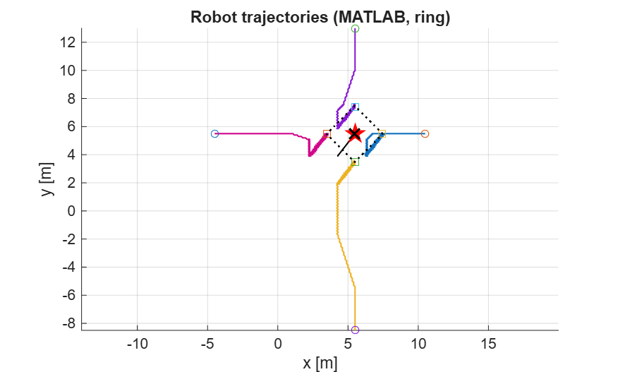

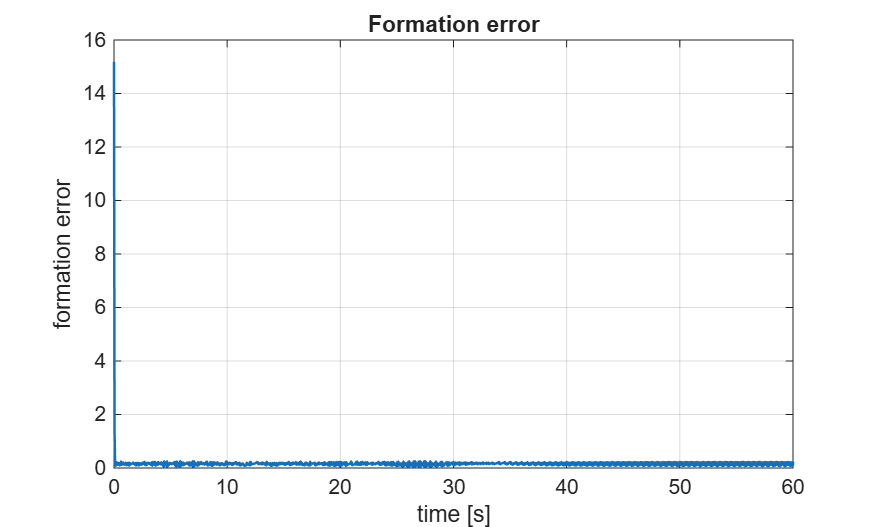 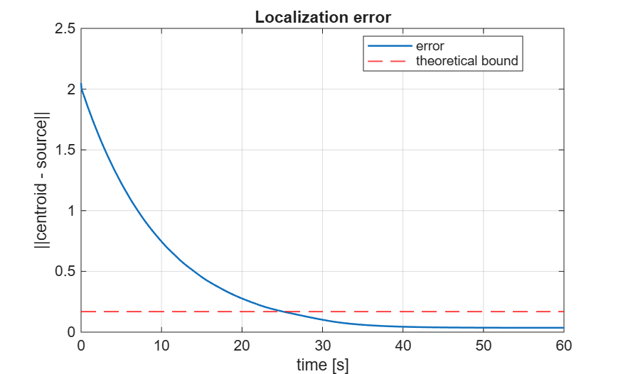

*Per-robot formation error (paper Fig. 3 style):*

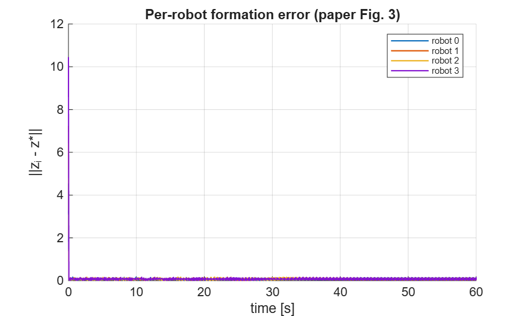

### `si_n4_srcA_gaussian`  ·  single_integrator  ·  n=4  ·  source [5.5, 5.5]  ·  noise `gaussian`

*Run folder:* `outputs/batch_report/runs/si_n4_srcA_gaussian_matlab`  ·  *wall time:* 329 s

<table><tr><td valign=top>

| Parameter | Value |
|---|---|
| n | 4 |
| source | [5.5, 5.5] |
| kappa | 1 |
| R | 2 |
| Dmax | 12 |
| alpha | 100 |
| beta | 0.05 |
| noise_model | gaussian |
| noise_bound δ | 0.2 |
| dt | 0.0005 |
| duration | 60 |
| topology | ring |
| seed | 1 |

</td><td valign=top>

| Metric | Value |
|---|---|
| initial formation error | 15.18 |
| final formation error | 0.1074 |
| initial localization error | 2.05 |
| final localization error | 0.03542 |
| formation entry time [s] | 0.048 |
| localization entry time [s] | 25.1 |
| gain ratio | 2000 |
| gain threshold 4n·f_Dmax/R | 1154 |
| gain condition passed | True |
| min / final n_informed | 3 / 4 |
| epsilon (ε) | 0.1692 |
| inside bound | n/a (unbounded gaussian noise) |

</td></tr></table>


 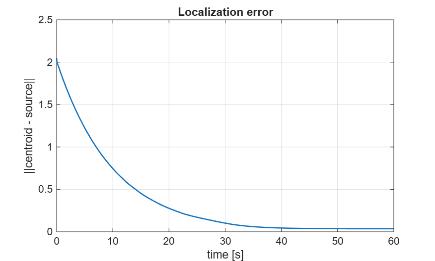

*Per-robot formation error (paper Fig. 3 style):*


*Animation — formation + source approach (source = red star, target circle dotted):*

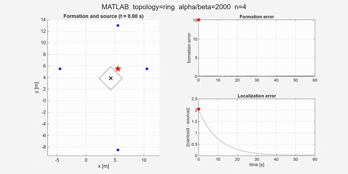

### `si_n4_srcB_none`  ·  single_integrator  ·  n=4  ·  source [30, -20]  ·  noise `none`

*Run folder:* `outputs/batch_report/runs/si_n4_srcB_none_matlab`  ·  *wall time:* 9.586 s

<table><tr><td valign=top>

| Parameter | Value |
|---|---|
| n | 4 |
| source | [30, -20] |
| kappa | 1 |
| R | 2 |
| Dmax | 12 |
| alpha | 100 |
| beta | 0.05 |
| noise_model | none |
| noise_bound δ | 0.2 |
| dt | 0.0005 |
| duration | 60 |
| topology | ring |
| seed | 1 |

</td><td valign=top>

| Metric | Value |
|---|---|
| initial formation error | 15.18 |
| final formation error | 0.107 |
| initial localization error | 2.05 |
| final localization error | 0.03549 |
| formation entry time [s] | 0.048 |
| localization entry time [s] | 25.08 |
| gain ratio | 2000 |
| gain threshold 4n·f_Dmax/R | 1154 |
| gain condition passed | True |
| min / final n_informed | 3 / 4 |
| epsilon (ε) | 0.1692 |
| inside bound | True |

</td></tr></table>


 

*Per-robot formation error (paper Fig. 3 style):*


### `si_n4_srcB_gaussian`  ·  single_integrator  ·  n=4  ·  source [30, -20]  ·  noise `gaussian`

*Run folder:* `outputs/batch_report/runs/si_n4_srcB_gaussian_matlab`  ·  *wall time:* 9.28 s

<table><tr><td valign=top>

| Parameter | Value |
|---|---|
| n | 4 |
| source | [30, -20] |
| kappa | 1 |
| R | 2 |
| Dmax | 12 |
| alpha | 100 |
| beta | 0.05 |
| noise_model | gaussian |
| noise_bound δ | 0.2 |
| dt | 0.0005 |
| duration | 60 |
| topology | ring |
| seed | 1 |

</td><td valign=top>

| Metric | Value |
|---|---|
| initial formation error | 15.18 |
| final formation error | 0.1074 |
| initial localization error | 2.05 |
| final localization error | 0.03542 |
| formation entry time [s] | 0.048 |
| localization entry time [s] | 25.1 |
| gain ratio | 2000 |
| gain threshold 4n·f_Dmax/R | 1154 |
| gain condition passed | True |
| min / final n_informed | 3 / 4 |
| epsilon (ε) | 0.1692 |
| inside bound | n/a (unbounded gaussian noise) |

</td></tr></table>

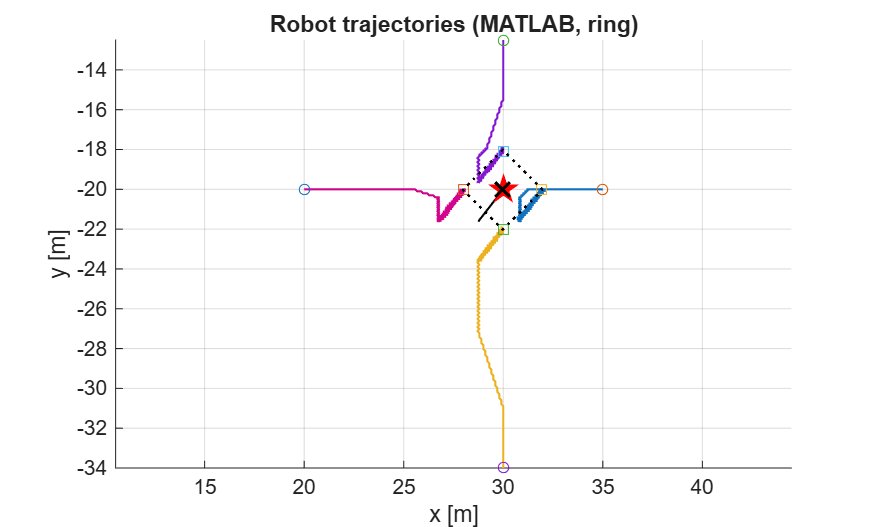

 

*Per-robot formation error (paper Fig. 3 style):*


### `si_n6_srcA_none`  ·  single_integrator  ·  n=6  ·  source [5.5, 5.5]  ·  noise `none`

*Run folder:* `outputs/batch_report/runs/si_n6_srcA_none_matlab`  ·  *wall time:* 336.8 s

<table><tr><td valign=top>

| Parameter | Value |
|---|---|
| n | 6 |
| source | [5.5, 5.5] |
| kappa | 1 |
| R | 2 |
| Dmax | 12 |
| alpha | 100 |
| beta | 0.05 |
| noise_model | none |
| noise_bound δ | 0.2 |
| dt | 0.0005 |
| duration | 60 |
| topology | ring |
| seed | 1 |

</td><td valign=top>

| Metric | Value |
|---|---|
| initial formation error | 21.65 |
| final formation error | 0.1776 |
| initial localization error | 2.42 |
| final localization error | 0.02007 |
| formation entry time [s] | 0.0855 |
| localization entry time [s] | 25.48 |
| gain ratio | 2000 |
| gain threshold 4n·f_Dmax/R | 1730 |
| gain condition passed | True |
| min / final n_informed | 4 / 6 |
| epsilon (ε) | 0.1891 |
| inside bound | True |

</td></tr></table>


 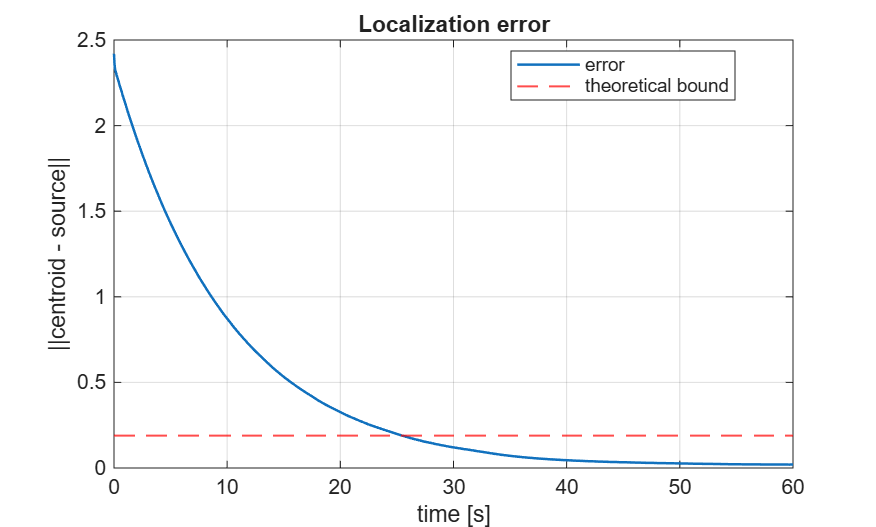

*Per-robot formation error (paper Fig. 3 style):*

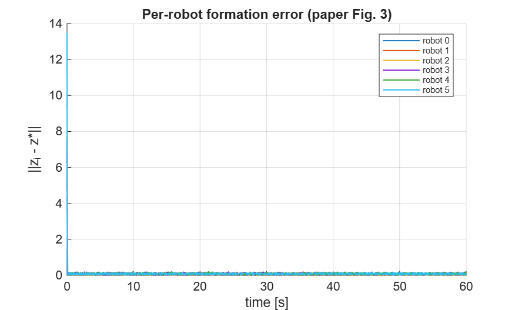

*Animation — formation + source approach (source = red star, target circle dotted):*


### `si_n6_srcA_gaussian`  ·  single_integrator  ·  n=6  ·  source [5.5, 5.5]  ·  noise `gaussian`

*Run folder:* `outputs/batch_report/runs/si_n6_srcA_gaussian_matlab`  ·  *wall time:* 283.9 s

<table><tr><td valign=top>

| Parameter | Value |
|---|---|
| n | 6 |
| source | [5.5, 5.5] |
| kappa | 1 |
| R | 2 |
| Dmax | 12 |
| alpha | 100 |
| beta | 0.05 |
| noise_model | gaussian |
| noise_bound δ | 0.2 |
| dt | 0.0005 |
| duration | 60 |
| topology | ring |
| seed | 1 |

</td><td valign=top>

| Metric | Value |
|---|---|
| initial formation error | 21.65 |
| final formation error | 0.1872 |
| initial localization error | 2.42 |
| final localization error | 0.02012 |
| formation entry time [s] | 0.0855 |
| localization entry time [s] | 25.49 |
| gain ratio | 2000 |
| gain threshold 4n·f_Dmax/R | 1730 |
| gain condition passed | True |
| min / final n_informed | 4 / 6 |
| epsilon (ε) | 0.1891 |
| inside bound | n/a (unbounded gaussian noise) |

</td></tr></table>


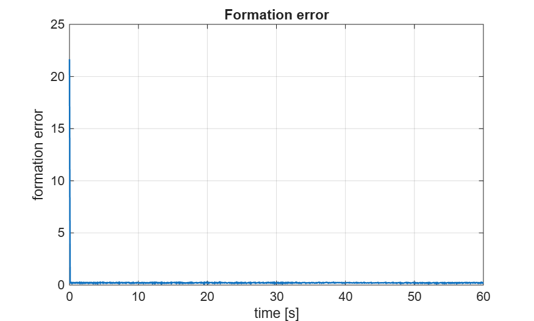 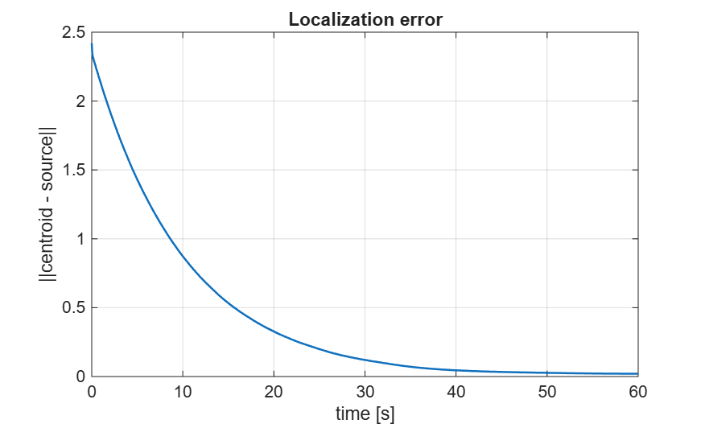

*Per-robot formation error (paper Fig. 3 style):*

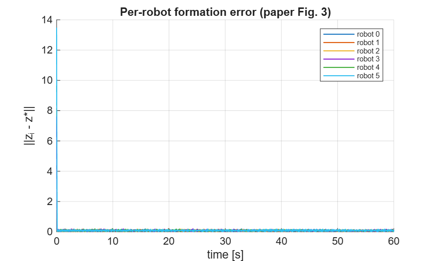

*Animation — formation + source approach (source = red star, target circle dotted):*

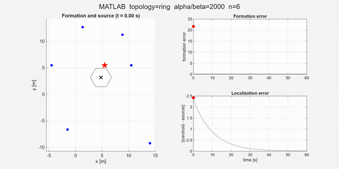

### `si_n6_srcB_none`  ·  single_integrator  ·  n=6  ·  source [30, -20]  ·  noise `none`

*Run folder:* `outputs/batch_report/runs/si_n6_srcB_none_matlab`  ·  *wall time:* 11.82 s

<table><tr><td valign=top>

| Parameter | Value |
|---|---|
| n | 6 |
| source | [30, -20] |
| kappa | 1 |
| R | 2 |
| Dmax | 12 |
| alpha | 100 |
| beta | 0.05 |
| noise_model | none |
| noise_bound δ | 0.2 |
| dt | 0.0005 |
| duration | 60 |
| topology | ring |
| seed | 1 |

</td><td valign=top>

| Metric | Value |
|---|---|
| initial formation error | 21.65 |
| final formation error | 0.1776 |
| initial localization error | 2.42 |
| final localization error | 0.02007 |
| formation entry time [s] | 0.0855 |
| localization entry time [s] | 25.48 |
| gain ratio | 2000 |
| gain threshold 4n·f_Dmax/R | 1730 |
| gain condition passed | True |
| min / final n_informed | 4 / 6 |
| epsilon (ε) | 0.1891 |
| inside bound | True |

</td></tr></table>

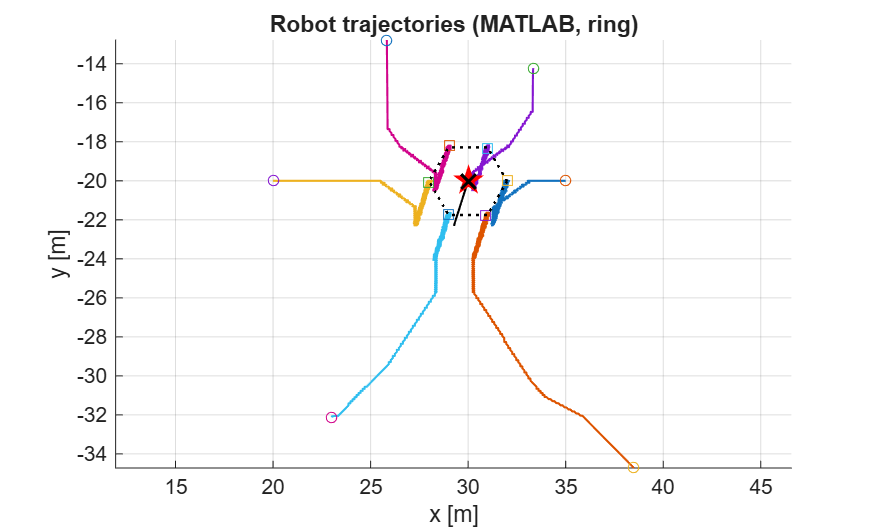

 

*Per-robot formation error (paper Fig. 3 style):*


### `si_n6_srcB_gaussian`  ·  single_integrator  ·  n=6  ·  source [30, -20]  ·  noise `gaussian`

*Run folder:* `outputs/batch_report/runs/si_n6_srcB_gaussian_matlab`  ·  *wall time:* 11 s

<table><tr><td valign=top>

| Parameter | Value |
|---|---|
| n | 6 |
| source | [30, -20] |
| kappa | 1 |
| R | 2 |
| Dmax | 12 |
| alpha | 100 |
| beta | 0.05 |
| noise_model | gaussian |
| noise_bound δ | 0.2 |
| dt | 0.0005 |
| duration | 60 |
| topology | ring |
| seed | 1 |

</td><td valign=top>

| Metric | Value |
|---|---|
| initial formation error | 21.65 |
| final formation error | 0.1872 |
| initial localization error | 2.42 |
| final localization error | 0.02012 |
| formation entry time [s] | 0.0855 |
| localization entry time [s] | 25.49 |
| gain ratio | 2000 |
| gain threshold 4n·f_Dmax/R | 1730 |
| gain condition passed | True |
| min / final n_informed | 4 / 6 |
| epsilon (ε) | 0.1891 |
| inside bound | n/a (unbounded gaussian noise) |

</td></tr></table>

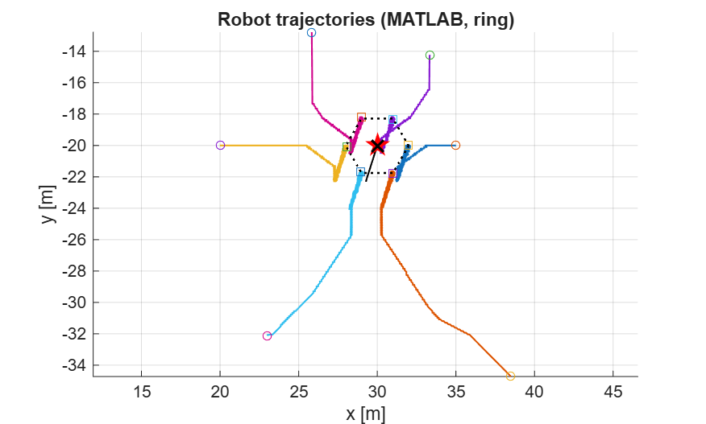

 

*Per-robot formation error (paper Fig. 3 style):*


### `si_n8_srcA_none`  ·  single_integrator  ·  n=8  ·  source [5.5, 5.5]  ·  noise `none`

*Run folder:* `outputs/batch_report/runs/si_n8_srcA_none_matlab`  ·  *wall time:* 12.63 s

<table><tr><td valign=top>

| Parameter | Value |
|---|---|
| n | 8 |
| source | [5.5, 5.5] |
| kappa | 1 |
| R | 2 |
| Dmax | 12 |
| alpha | 100 |
| beta | 0.05 |
| noise_model | none |
| noise_bound δ | 0.2 |
| dt | 0.0005 |
| duration | 60 |
| topology | ring |
| seed | 1 |

</td><td valign=top>

| Metric | Value |
|---|---|
| initial formation error | 25.86 |
| final formation error | 0.2527 |
| initial localization error | 2.483 |
| final localization error | 0.01402 |
| formation entry time [s] | 0.114 |
| localization entry time [s] | 25.59 |
| gain ratio | 2000 |
| gain threshold 4n·f_Dmax/R | 2307 |
| gain condition passed | False |
| min / final n_informed | 5 / 8 |
| epsilon (ε) | 0.1951 |
| inside bound | True |

</td></tr></table>


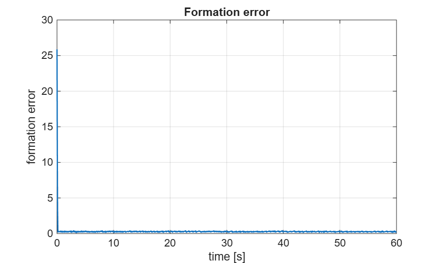 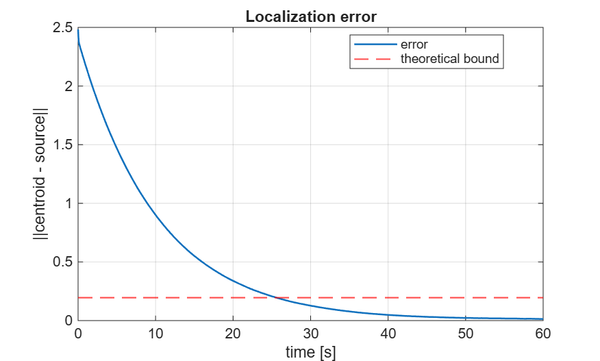

*Per-robot formation error (paper Fig. 3 style):*

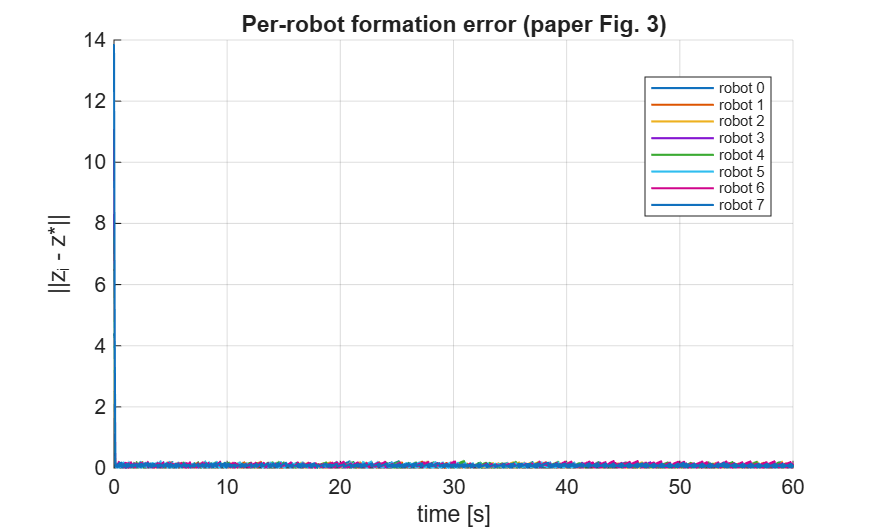

### `si_n8_srcA_gaussian`  ·  single_integrator  ·  n=8  ·  source [5.5, 5.5]  ·  noise `gaussian`

*Run folder:* `outputs/batch_report/runs/si_n8_srcA_gaussian_matlab`  ·  *wall time:* 295.4 s

<table><tr><td valign=top>

| Parameter | Value |
|---|---|
| n | 8 |
| source | [5.5, 5.5] |
| kappa | 1 |
| R | 2 |
| Dmax | 12 |
| alpha | 100 |
| beta | 0.05 |
| noise_model | gaussian |
| noise_bound δ | 0.2 |
| dt | 0.0005 |
| duration | 60 |
| topology | ring |
| seed | 1 |

</td><td valign=top>

| Metric | Value |
|---|---|
| initial formation error | 25.86 |
| final formation error | 0.2346 |
| initial localization error | 2.483 |
| final localization error | 0.01729 |
| formation entry time [s] | 0.114 |
| localization entry time [s] | 25.54 |
| gain ratio | 2000 |
| gain threshold 4n·f_Dmax/R | 2307 |
| gain condition passed | False |
| min / final n_informed | 5 / 8 |
| epsilon (ε) | 0.1951 |
| inside bound | n/a (unbounded gaussian noise) |

</td></tr></table>

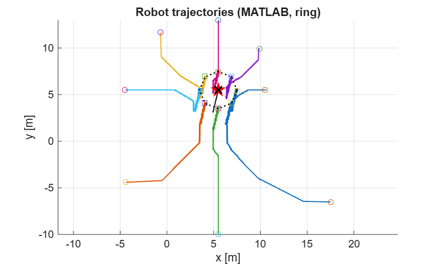

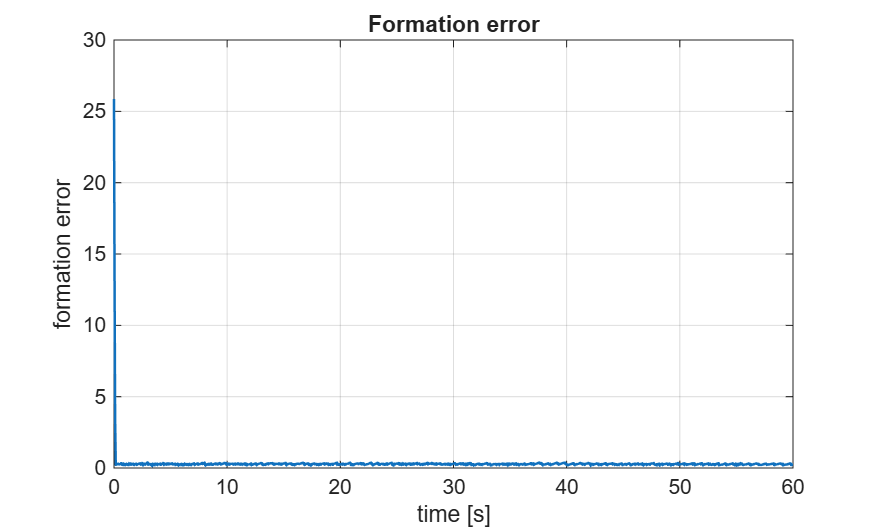 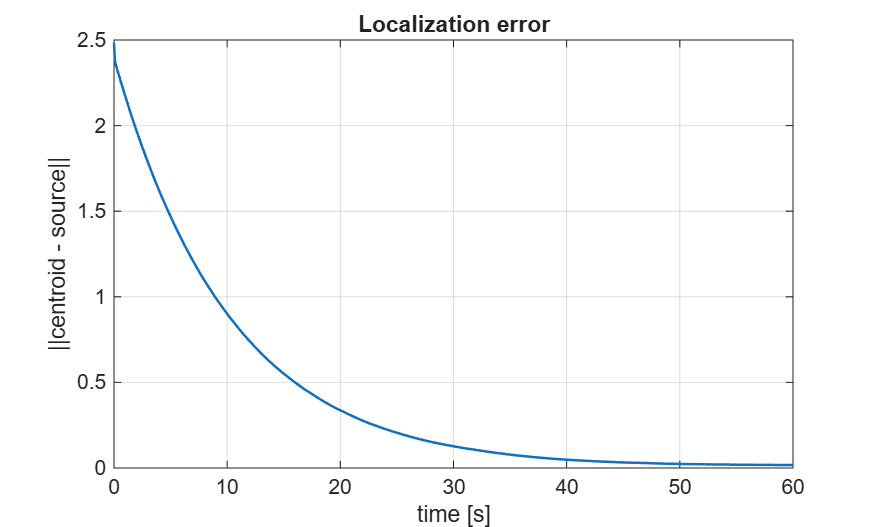

*Per-robot formation error (paper Fig. 3 style):*

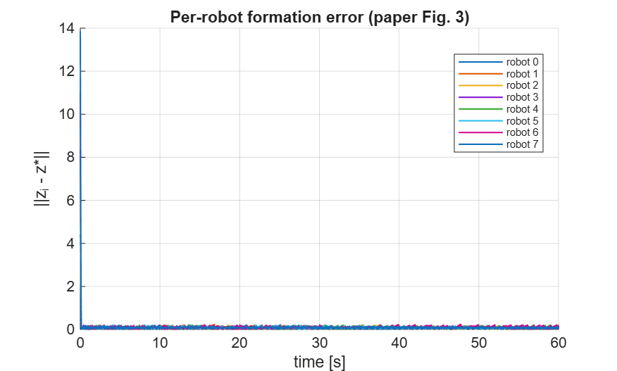

*Animation — formation + source approach (source = red star, target circle dotted):*

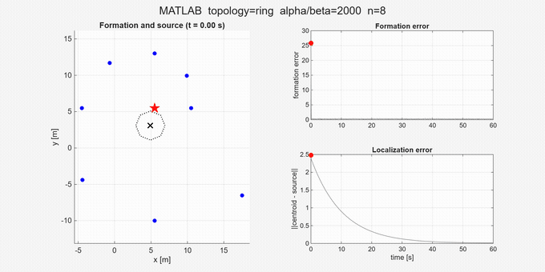

### `si_n8_srcB_none`  ·  single_integrator  ·  n=8  ·  source [30, -20]  ·  noise `none`

*Run folder:* `outputs/batch_report/runs/si_n8_srcB_none_matlab`  ·  *wall time:* 12.68 s

<table><tr><td valign=top>

| Parameter | Value |
|---|---|
| n | 8 |
| source | [30, -20] |
| kappa | 1 |
| R | 2 |
| Dmax | 12 |
| alpha | 100 |
| beta | 0.05 |
| noise_model | none |
| noise_bound δ | 0.2 |
| dt | 0.0005 |
| duration | 60 |
| topology | ring |
| seed | 1 |

</td><td valign=top>

| Metric | Value |
|---|---|
| initial formation error | 25.86 |
| final formation error | 0.2527 |
| initial localization error | 2.483 |
| final localization error | 0.01402 |
| formation entry time [s] | 0.114 |
| localization entry time [s] | 25.59 |
| gain ratio | 2000 |
| gain threshold 4n·f_Dmax/R | 2307 |
| gain condition passed | False |
| min / final n_informed | 5 / 8 |
| epsilon (ε) | 0.1951 |
| inside bound | True |

</td></tr></table>

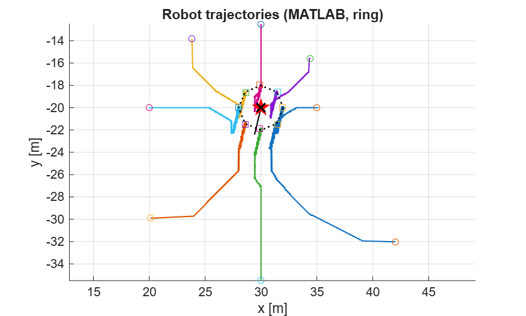

 

*Per-robot formation error (paper Fig. 3 style):*


### `si_n8_srcB_gaussian`  ·  single_integrator  ·  n=8  ·  source [30, -20]  ·  noise `gaussian`

*Run folder:* `outputs/batch_report/runs/si_n8_srcB_gaussian_matlab`  ·  *wall time:* 12.3 s

<table><tr><td valign=top>

| Parameter | Value |
|---|---|
| n | 8 |
| source | [30, -20] |
| kappa | 1 |
| R | 2 |
| Dmax | 12 |
| alpha | 100 |
| beta | 0.05 |
| noise_model | gaussian |
| noise_bound δ | 0.2 |
| dt | 0.0005 |
| duration | 60 |
| topology | ring |
| seed | 1 |

</td><td valign=top>

| Metric | Value |
|---|---|
| initial formation error | 25.86 |
| final formation error | 0.2346 |
| initial localization error | 2.483 |
| final localization error | 0.01729 |
| formation entry time [s] | 0.114 |
| localization entry time [s] | 25.54 |
| gain ratio | 2000 |
| gain threshold 4n·f_Dmax/R | 2307 |
| gain condition passed | False |
| min / final n_informed | 5 / 8 |
| epsilon (ε) | 0.1951 |
| inside bound | n/a (unbounded gaussian noise) |

</td></tr></table>


 

*Per-robot formation error (paper Fig. 3 style):*


## 5. TurtleBot Simulink runs (12)

### `ts_n4_srcA_none`  ·  turtlebot_simulink  ·  n=4  ·  source [5.5, 5.5]  ·  noise `none`

*Run folder:* `outputs/batch_report/runs/ts_n4_srcA_none_turtlebot`  ·  *wall time:* 7.158 s

<table><tr><td valign=top>

| Parameter | Value |
|---|---|
| n | 4 |
| source | [5.5, 5.5] |
| kappa | 1 |
| R | 2 |
| Dmax | 12 |
| alpha | 10 |
| beta | 0.05 |
| noise_model | none |
| noise_bound δ | 0.2 |
| dt | 0.004 |
| duration | 90 |
| topology | ring |
| seed | 1 |
| offset r | 2 |
| sign_boundary_layer | 0.2 |
| wheel_radius | 0.033 |
| wheel_separation | 0.16 |

</td><td valign=top>

| Metric | Value |
|---|---|
| initial formation error | 15.18 |
| final formation error | 0.003992 |
| initial localization error | 1.79 |
| final localization error | 0.0001958 |
| gain ratio | 200 |
| gain threshold 4n·f_Dmax/R | 1154 |
| gain condition passed | False |
| min / final n_informed | 3 / 4 |
| epsilon (ε) | 0.1692 |
| inside bound | True |
| max commanded |v| [m/s] | 24.18 |
| max commanded |ω| [rad/s] | 13.61 |

</td></tr></table>

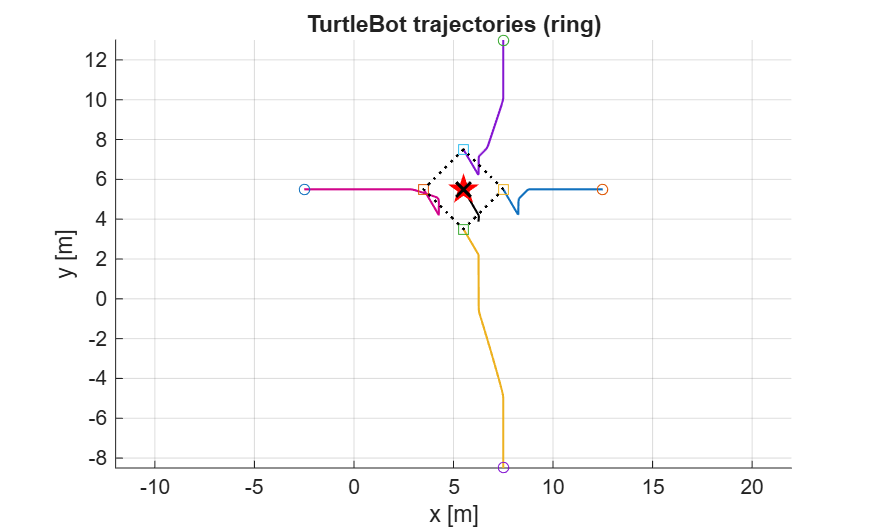

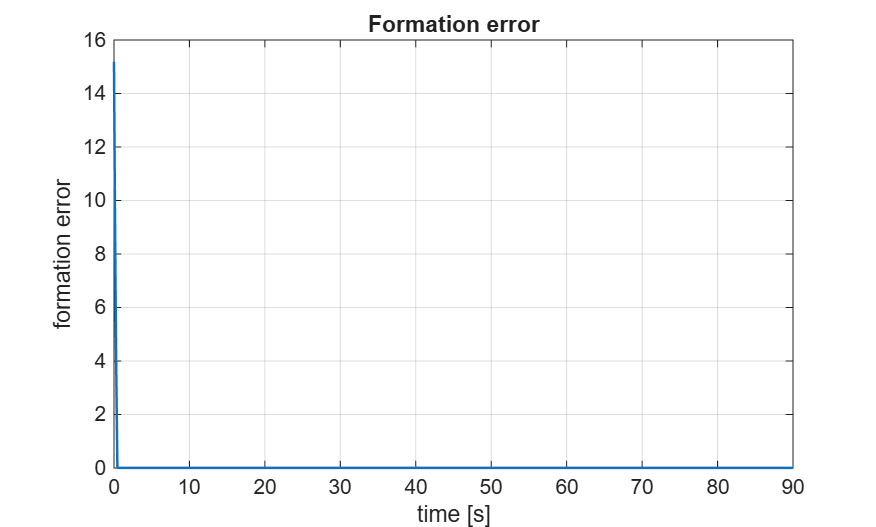 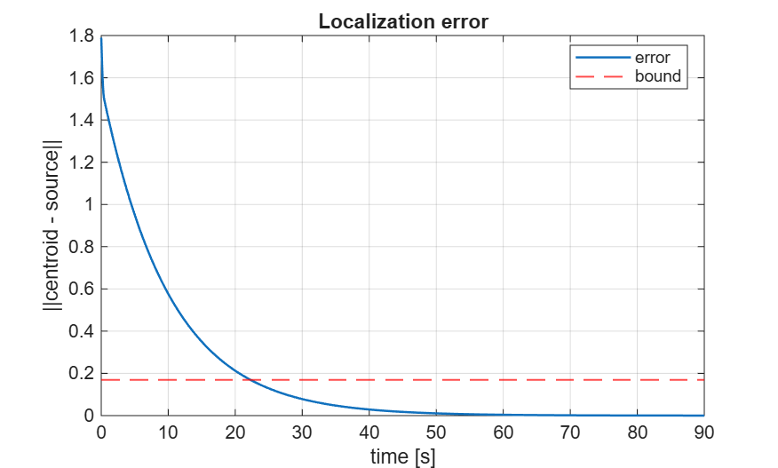

### `ts_n4_srcA_gaussian`  ·  turtlebot_simulink  ·  n=4  ·  source [5.5, 5.5]  ·  noise `gaussian`

*Run folder:* `outputs/batch_report/runs/ts_n4_srcA_gaussian_turtlebot`  ·  *wall time:* 208.6 s

<table><tr><td valign=top>

| Parameter | Value |
|---|---|
| n | 4 |
| source | [5.5, 5.5] |
| kappa | 1 |
| R | 2 |
| Dmax | 12 |
| alpha | 10 |
| beta | 0.05 |
| noise_model | gaussian |
| noise_bound δ | 0.2 |
| dt | 0.004 |
| duration | 90 |
| topology | ring |
| seed | 1 |
| offset r | 2 |
| sign_boundary_layer | 0.2 |
| wheel_radius | 0.033 |
| wheel_separation | 0.16 |

</td><td valign=top>

| Metric | Value |
|---|---|
| initial formation error | 15.18 |
| final formation error | 0.003938 |
| initial localization error | 1.79 |
| final localization error | 0.0008902 |
| gain ratio | 200 |
| gain threshold 4n·f_Dmax/R | 1154 |
| gain condition passed | False |
| min / final n_informed | 3 / 4 |
| epsilon (ε) | 0.1692 |
| inside bound | n/a (unbounded gaussian noise) |
| max commanded |v| [m/s] | 24.16 |
| max commanded |ω| [rad/s] | 13.61 |

</td></tr></table>


 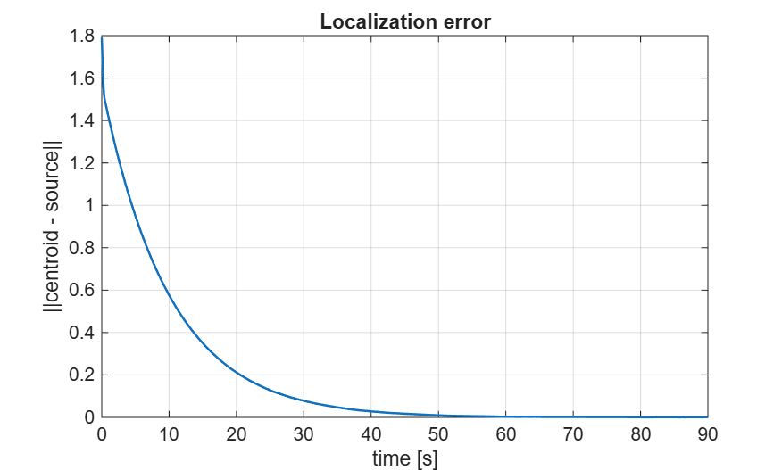

*Animation — formation + source approach (source = red star, target circle dotted):*

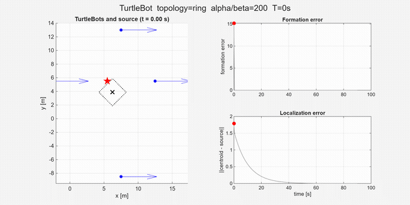

### `ts_n4_srcB_none`  ·  turtlebot_simulink  ·  n=4  ·  source [30, -20]  ·  noise `none`

*Run folder:* `outputs/batch_report/runs/ts_n4_srcB_none_turtlebot`  ·  *wall time:* 5.544 s

<table><tr><td valign=top>

| Parameter | Value |
|---|---|
| n | 4 |
| source | [30, -20] |
| kappa | 1 |
| R | 2 |
| Dmax | 12 |
| alpha | 10 |
| beta | 0.05 |
| noise_model | none |
| noise_bound δ | 0.2 |
| dt | 0.004 |
| duration | 90 |
| topology | ring |
| seed | 1 |
| offset r | 2 |
| sign_boundary_layer | 0.2 |
| wheel_radius | 0.033 |
| wheel_separation | 0.16 |

</td><td valign=top>

| Metric | Value |
|---|---|
| initial formation error | 15.18 |
| final formation error | 0.003992 |
| initial localization error | 1.79 |
| final localization error | 0.0001958 |
| gain ratio | 200 |
| gain threshold 4n·f_Dmax/R | 1154 |
| gain condition passed | False |
| min / final n_informed | 3 / 4 |
| epsilon (ε) | 0.1692 |
| inside bound | True |
| max commanded |v| [m/s] | 24.18 |
| max commanded |ω| [rad/s] | 13.61 |

</td></tr></table>

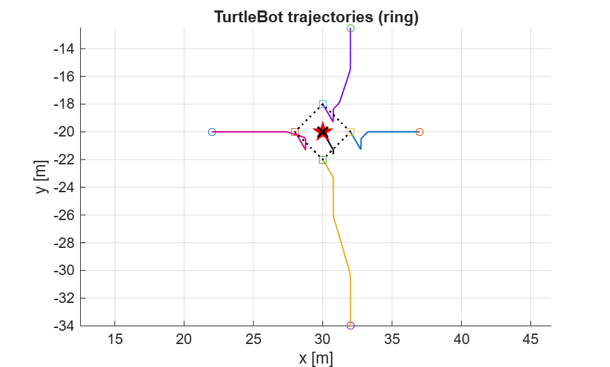

 

### `ts_n4_srcB_gaussian`  ·  turtlebot_simulink  ·  n=4  ·  source [30, -20]  ·  noise `gaussian`

*Run folder:* `outputs/batch_report/runs/ts_n4_srcB_gaussian_turtlebot`  ·  *wall time:* 7.23 s

<table><tr><td valign=top>

| Parameter | Value |
|---|---|
| n | 4 |
| source | [30, -20] |
| kappa | 1 |
| R | 2 |
| Dmax | 12 |
| alpha | 10 |
| beta | 0.05 |
| noise_model | gaussian |
| noise_bound δ | 0.2 |
| dt | 0.004 |
| duration | 90 |
| topology | ring |
| seed | 1 |
| offset r | 2 |
| sign_boundary_layer | 0.2 |
| wheel_radius | 0.033 |
| wheel_separation | 0.16 |

</td><td valign=top>

| Metric | Value |
|---|---|
| initial formation error | 15.18 |
| final formation error | 0.003938 |
| initial localization error | 1.79 |
| final localization error | 0.0008902 |
| gain ratio | 200 |
| gain threshold 4n·f_Dmax/R | 1154 |
| gain condition passed | False |
| min / final n_informed | 3 / 4 |
| epsilon (ε) | 0.1692 |
| inside bound | n/a (unbounded gaussian noise) |
| max commanded |v| [m/s] | 24.17 |
| max commanded |ω| [rad/s] | 13.61 |

</td></tr></table>


 

### `ts_n6_srcA_none`  ·  turtlebot_simulink  ·  n=6  ·  source [5.5, 5.5]  ·  noise `none`

*Run folder:* `outputs/batch_report/runs/ts_n6_srcA_none_turtlebot`  ·  *wall time:* 340.4 s

<table><tr><td valign=top>

| Parameter | Value |
|---|---|
| n | 6 |
| source | [5.5, 5.5] |
| kappa | 1 |
| R | 2 |
| Dmax | 12 |
| alpha | 10 |
| beta | 0.05 |
| noise_model | none |
| noise_bound δ | 0.2 |
| dt | 0.004 |
| duration | 90 |
| topology | ring |
| seed | 1 |
| offset r | 2 |
| sign_boundary_layer | 0.2 |
| wheel_radius | 0.033 |
| wheel_separation | 0.16 |

</td><td valign=top>

| Metric | Value |
|---|---|
| initial formation error | 21.65 |
| final formation error | 0.009759 |
| initial localization error | 2.639 |
| final localization error | 0.0002761 |
| gain ratio | 200 |
| gain threshold 4n·f_Dmax/R | 1730 |
| gain condition passed | False |
| min / final n_informed | 4 / 6 |
| epsilon (ε) | 0.1891 |
| inside bound | True |
| max commanded |v| [m/s] | 30.41 |
| max commanded |ω| [rad/s] | 17.64 |

</td></tr></table>

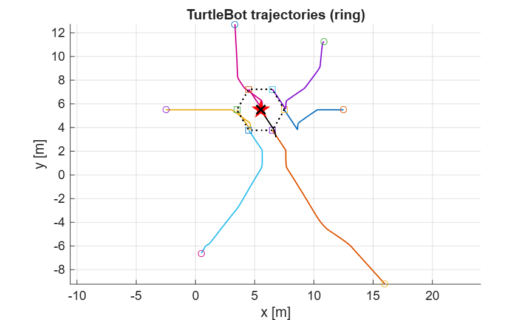

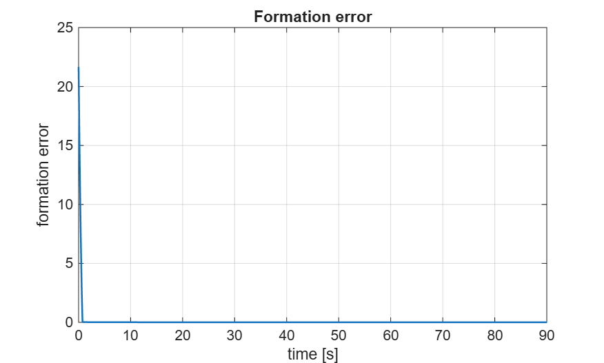 

*Animation — formation + source approach (source = red star, target circle dotted):*

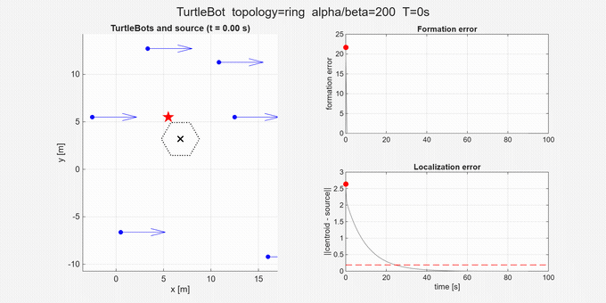

### `ts_n6_srcA_gaussian`  ·  turtlebot_simulink  ·  n=6  ·  source [5.5, 5.5]  ·  noise `gaussian`

*Run folder:* `outputs/batch_report/runs/ts_n6_srcA_gaussian_turtlebot`  ·  *wall time:* 196.2 s

<table><tr><td valign=top>

| Parameter | Value |
|---|---|
| n | 6 |
| source | [5.5, 5.5] |
| kappa | 1 |
| R | 2 |
| Dmax | 12 |
| alpha | 10 |
| beta | 0.05 |
| noise_model | gaussian |
| noise_bound δ | 0.2 |
| dt | 0.004 |
| duration | 90 |
| topology | ring |
| seed | 1 |
| offset r | 2 |
| sign_boundary_layer | 0.2 |
| wheel_radius | 0.033 |
| wheel_separation | 0.16 |

</td><td valign=top>

| Metric | Value |
|---|---|
| initial formation error | 21.65 |
| final formation error | 0.009697 |
| initial localization error | 2.639 |
| final localization error | 0.0005692 |
| gain ratio | 200 |
| gain threshold 4n·f_Dmax/R | 1730 |
| gain condition passed | False |
| min / final n_informed | 4 / 6 |
| epsilon (ε) | 0.1891 |
| inside bound | n/a (unbounded gaussian noise) |
| max commanded |v| [m/s] | 30.41 |
| max commanded |ω| [rad/s] | 17.64 |

</td></tr></table>


 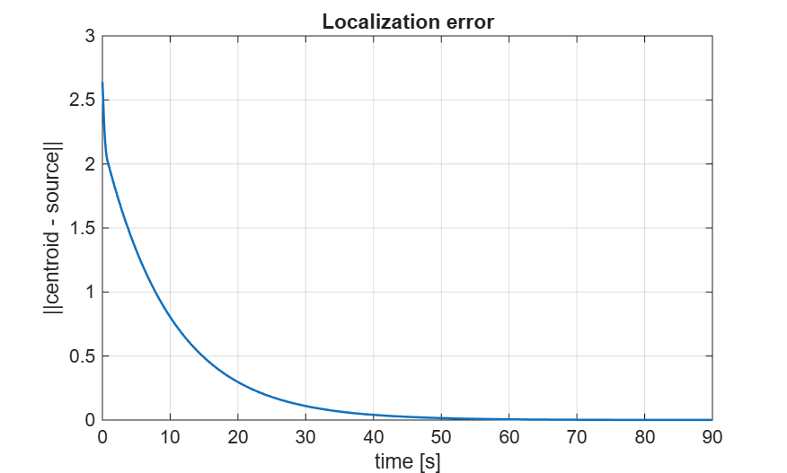

*Animation — formation + source approach (source = red star, target circle dotted):*

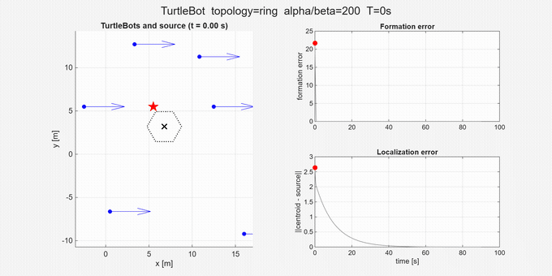

### `ts_n6_srcB_none`  ·  turtlebot_simulink  ·  n=6  ·  source [30, -20]  ·  noise `none`

*Run folder:* `outputs/batch_report/runs/ts_n6_srcB_none_turtlebot`  ·  *wall time:* 5.787 s

<table><tr><td valign=top>

| Parameter | Value |
|---|---|
| n | 6 |
| source | [30, -20] |
| kappa | 1 |
| R | 2 |
| Dmax | 12 |
| alpha | 10 |
| beta | 0.05 |
| noise_model | none |
| noise_bound δ | 0.2 |
| dt | 0.004 |
| duration | 90 |
| topology | ring |
| seed | 1 |
| offset r | 2 |
| sign_boundary_layer | 0.2 |
| wheel_radius | 0.033 |
| wheel_separation | 0.16 |

</td><td valign=top>

| Metric | Value |
|---|---|
| initial formation error | 21.65 |
| final formation error | 0.009759 |
| initial localization error | 2.639 |
| final localization error | 0.0002761 |
| gain ratio | 200 |
| gain threshold 4n·f_Dmax/R | 1730 |
| gain condition passed | False |
| min / final n_informed | 4 / 6 |
| epsilon (ε) | 0.1891 |
| inside bound | True |
| max commanded |v| [m/s] | 30.41 |
| max commanded |ω| [rad/s] | 17.64 |

</td></tr></table>

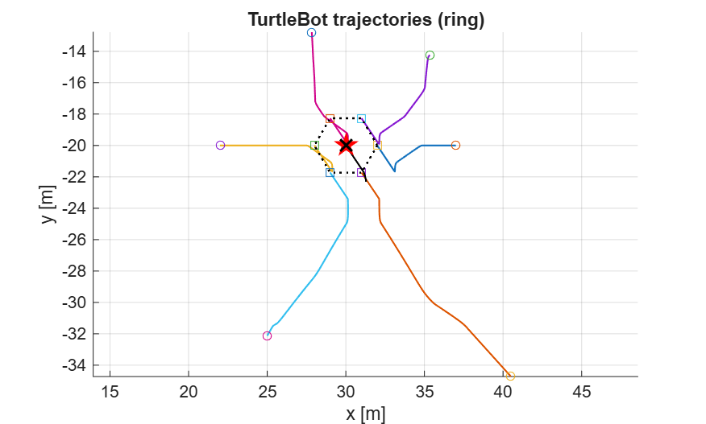

 

### `ts_n6_srcB_gaussian`  ·  turtlebot_simulink  ·  n=6  ·  source [30, -20]  ·  noise `gaussian`

*Run folder:* `outputs/batch_report/runs/ts_n6_srcB_gaussian_turtlebot`  ·  *wall time:* 7.151 s

<table><tr><td valign=top>

| Parameter | Value |
|---|---|
| n | 6 |
| source | [30, -20] |
| kappa | 1 |
| R | 2 |
| Dmax | 12 |
| alpha | 10 |
| beta | 0.05 |
| noise_model | gaussian |
| noise_bound δ | 0.2 |
| dt | 0.004 |
| duration | 90 |
| topology | ring |
| seed | 1 |
| offset r | 2 |
| sign_boundary_layer | 0.2 |
| wheel_radius | 0.033 |
| wheel_separation | 0.16 |

</td><td valign=top>

| Metric | Value |
|---|---|
| initial formation error | 21.65 |
| final formation error | 0.009697 |
| initial localization error | 2.639 |
| final localization error | 0.0005692 |
| gain ratio | 200 |
| gain threshold 4n·f_Dmax/R | 1730 |
| gain condition passed | False |
| min / final n_informed | 4 / 6 |
| epsilon (ε) | 0.1891 |
| inside bound | n/a (unbounded gaussian noise) |
| max commanded |v| [m/s] | 30.41 |
| max commanded |ω| [rad/s] | 17.64 |

</td></tr></table>


 

### `ts_n8_srcA_none`  ·  turtlebot_simulink  ·  n=8  ·  source [5.5, 5.5]  ·  noise `none`

*Run folder:* `outputs/batch_report/runs/ts_n8_srcA_none_turtlebot`  ·  *wall time:* 5.864 s

<table><tr><td valign=top>

| Parameter | Value |
|---|---|
| n | 8 |
| source | [5.5, 5.5] |
| kappa | 1 |
| R | 2 |
| Dmax | 12 |
| alpha | 10 |
| beta | 0.05 |
| noise_model | none |
| noise_bound δ | 0.2 |
| dt | 0.004 |
| duration | 90 |
| topology | ring |
| seed | 1 |
| offset r | 2 |
| sign_boundary_layer | 0.2 |
| wheel_radius | 0.033 |
| wheel_separation | 0.16 |

</td><td valign=top>

| Metric | Value |
|---|---|
| initial formation error | 25.86 |
| final formation error | 0.01918 |
| initial localization error | 2.8 |
| final localization error | 0.0002931 |
| gain ratio | 200 |
| gain threshold 4n·f_Dmax/R | 2307 |
| gain condition passed | False |
| min / final n_informed | 5 / 8 |
| epsilon (ε) | 0.1951 |
| inside bound | True |
| max commanded |v| [m/s] | 27.5 |
| max commanded |ω| [rad/s] | 14.71 |

</td></tr></table>

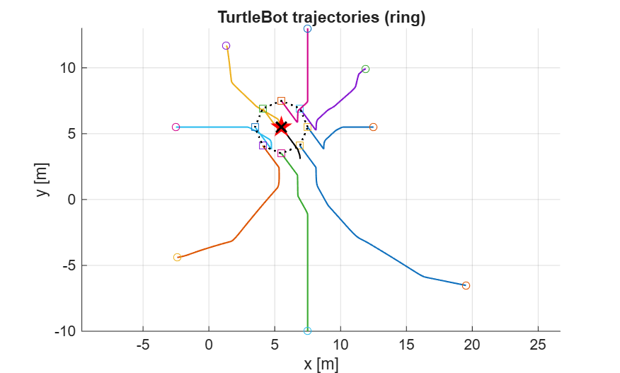

 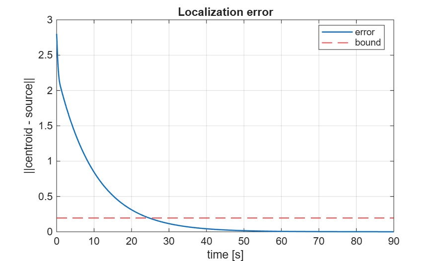

### `ts_n8_srcA_gaussian`  ·  turtlebot_simulink  ·  n=8  ·  source [5.5, 5.5]  ·  noise `gaussian`

*Run folder:* `outputs/batch_report/runs/ts_n8_srcA_gaussian_turtlebot`  ·  *wall time:* 186.4 s

<table><tr><td valign=top>

| Parameter | Value |
|---|---|
| n | 8 |
| source | [5.5, 5.5] |
| kappa | 1 |
| R | 2 |
| Dmax | 12 |
| alpha | 10 |
| beta | 0.05 |
| noise_model | gaussian |
| noise_bound δ | 0.2 |
| dt | 0.004 |
| duration | 90 |
| topology | ring |
| seed | 1 |
| offset r | 2 |
| sign_boundary_layer | 0.2 |
| wheel_radius | 0.033 |
| wheel_separation | 0.16 |

</td><td valign=top>

| Metric | Value |
|---|---|
| initial formation error | 25.86 |
| final formation error | 0.01909 |
| initial localization error | 2.8 |
| final localization error | 0.0005348 |
| gain ratio | 200 |
| gain threshold 4n·f_Dmax/R | 2307 |
| gain condition passed | False |
| min / final n_informed | 5 / 8 |
| epsilon (ε) | 0.1951 |
| inside bound | n/a (unbounded gaussian noise) |
| max commanded |v| [m/s] | 27.51 |
| max commanded |ω| [rad/s] | 14.71 |

</td></tr></table>


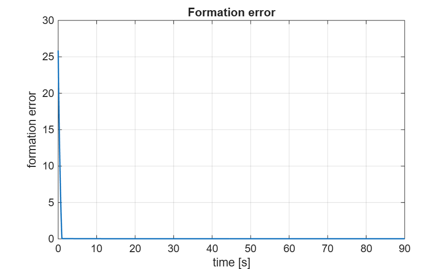 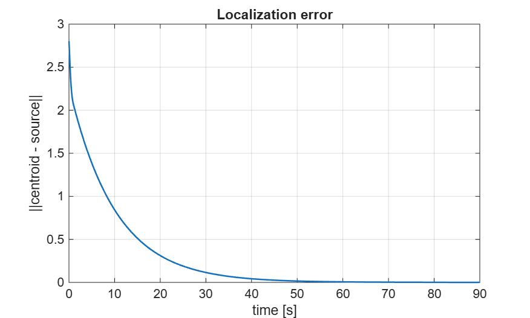

*Animation — formation + source approach (source = red star, target circle dotted):*

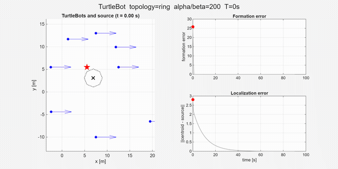

### `ts_n8_srcB_none`  ·  turtlebot_simulink  ·  n=8  ·  source [30, -20]  ·  noise `none`

*Run folder:* `outputs/batch_report/runs/ts_n8_srcB_none_turtlebot`  ·  *wall time:* 6.021 s

<table><tr><td valign=top>

| Parameter | Value |
|---|---|
| n | 8 |
| source | [30, -20] |
| kappa | 1 |
| R | 2 |
| Dmax | 12 |
| alpha | 10 |
| beta | 0.05 |
| noise_model | none |
| noise_bound δ | 0.2 |
| dt | 0.004 |
| duration | 90 |
| topology | ring |
| seed | 1 |
| offset r | 2 |
| sign_boundary_layer | 0.2 |
| wheel_radius | 0.033 |
| wheel_separation | 0.16 |

</td><td valign=top>

| Metric | Value |
|---|---|
| initial formation error | 25.86 |
| final formation error | 0.01918 |
| initial localization error | 2.8 |
| final localization error | 0.0002931 |
| gain ratio | 200 |
| gain threshold 4n·f_Dmax/R | 2307 |
| gain condition passed | False |
| min / final n_informed | 5 / 8 |
| epsilon (ε) | 0.1951 |
| inside bound | True |
| max commanded |v| [m/s] | 27.5 |
| max commanded |ω| [rad/s] | 14.71 |

</td></tr></table>


 

### `ts_n8_srcB_gaussian`  ·  turtlebot_simulink  ·  n=8  ·  source [30, -20]  ·  noise `gaussian`

*Run folder:* `outputs/batch_report/runs/ts_n8_srcB_gaussian_turtlebot`  ·  *wall time:* 7.438 s

<table><tr><td valign=top>

| Parameter | Value |
|---|---|
| n | 8 |
| source | [30, -20] |
| kappa | 1 |
| R | 2 |
| Dmax | 12 |
| alpha | 10 |
| beta | 0.05 |
| noise_model | gaussian |
| noise_bound δ | 0.2 |
| dt | 0.004 |
| duration | 90 |
| topology | ring |
| seed | 1 |
| offset r | 2 |
| sign_boundary_layer | 0.2 |
| wheel_radius | 0.033 |
| wheel_separation | 0.16 |

</td><td valign=top>

| Metric | Value |
|---|---|
| initial formation error | 25.86 |
| final formation error | 0.01909 |
| initial localization error | 2.8 |
| final localization error | 0.0005348 |
| gain ratio | 200 |
| gain threshold 4n·f_Dmax/R | 2307 |
| gain condition passed | False |
| min / final n_informed | 5 / 8 |
| epsilon (ε) | 0.1951 |
| inside bound | n/a (unbounded gaussian noise) |
| max commanded |v| [m/s] | 27.49 |
| max commanded |ω| [rad/s] | 14.71 |

</td></tr></table>

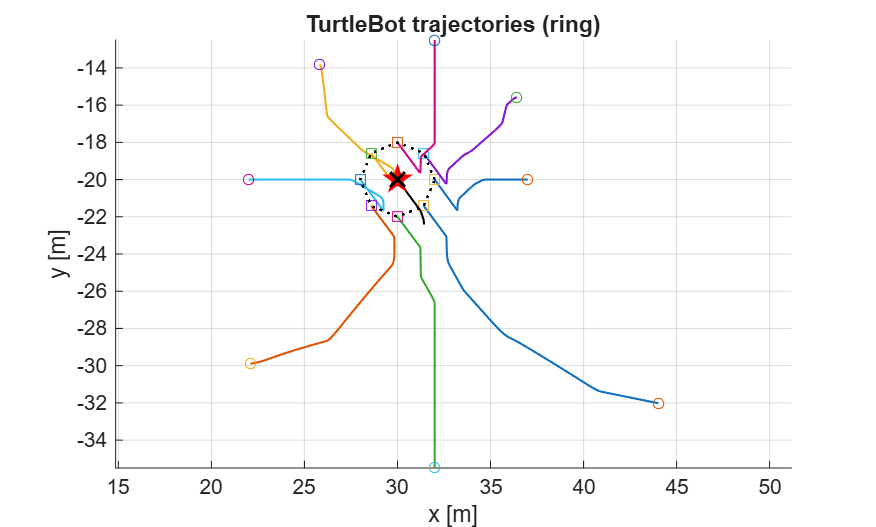

 

## 6. Gain sweeps (n = 6): what each gain actually controls

The 24 runs above use a large formation gain, so formation looks instant. These sweeps isolate each gain by varying one at a time with everything else identical (n = 6, source A, noise-free, the same 2-uninformed layout). §6.1 sweeps the formation gain α on the single-integrator model; §6.2 repeats the same α values on the TurtleBot-Simulink differential-drive model (plots + gifs); §6.3 pushes the localization gain β to an extreme (10000) to show the failure mode. Formation entry time is the first instant the spread falls below 5 % of its initial value (consistent across both models).

### 6.1 Single-integrator α sweep

Point-robot model with exact `sgn`. Only α varies; β = 0.05 fixed.

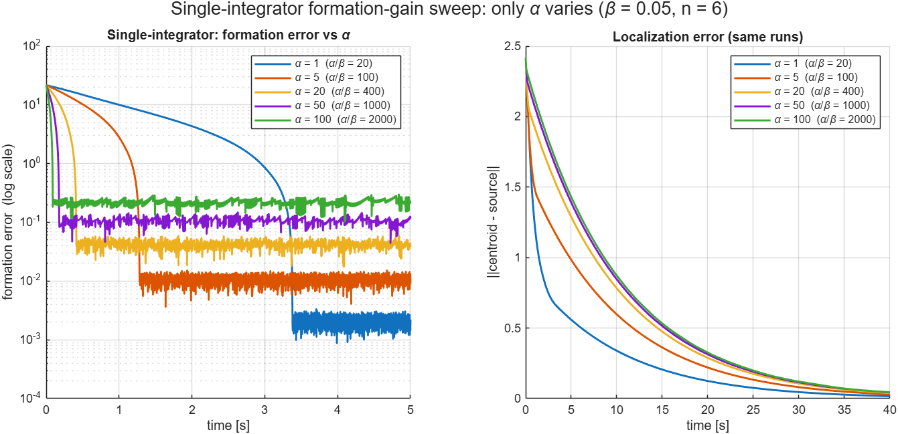

| α | α/β | formation entry [s] | final formation | final localization | inside ε? |
|---|---|---|---|---|---|
| 1 | 20 | 2.918 | 0.002287 | 0.002295 | yes |
| 5 | 100 | 1.166 | 0.01147 | 0.003964 | yes |
| 20 | 400 | 0.3845 | 0.04731 | 0.005353 | yes |
| 50 | 1000 | 0.166 | 0.1001 | 0.01163 | yes |
| 100 | 2000 | 0.0855 | 0.1776 | 0.02007 | yes |

Reading the sweep:

- **Formation time ∝ 1/α.** Formation entry drops from ≈ 2.9 s at α = 1 to ≈ 0.09 s at α = 100 — the finite-time consensus term `α·Σ sgn(z_j − z_i)` closes the initial spread faster the larger α is. On a 0–60 s axis, α = 100 looks like an instantaneous drop.
- **The chatter floor grows with α.** With the exact `sgn`, the steady-state formation residual *rises* with α (≈ 2×10⁻³ at α = 1 up to ≈ 0.18 at α = 100): a bigger gain drives a larger limit-cycle around the sliding surface. Faster formation is paid for with a coarser final circle.
- **Localization timescale is α-independent.** All five localization curves decay at nearly the same exponential rate `2βκ = 0.1 /s`, set by β, not α — smaller α even localizes slightly *faster* because it injects less chatter into the centroid.

*Per-run static plots, α increasing (each run's own trajectory, then its formation & localization error):*

**α = 1**  (`fg_n6_a1_srcA_none`)

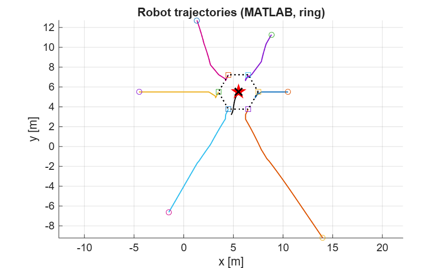

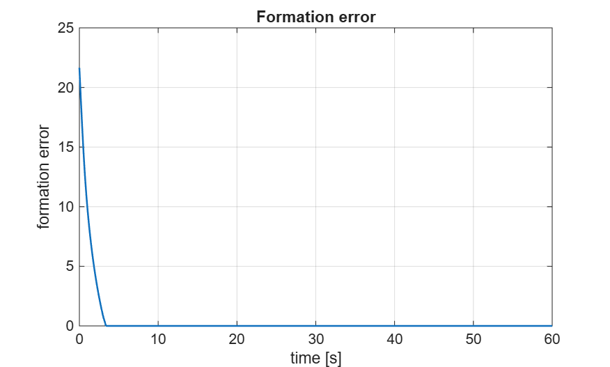 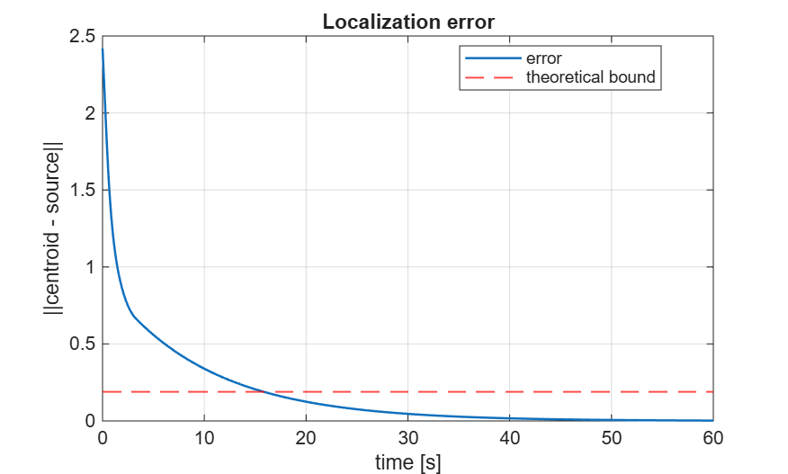

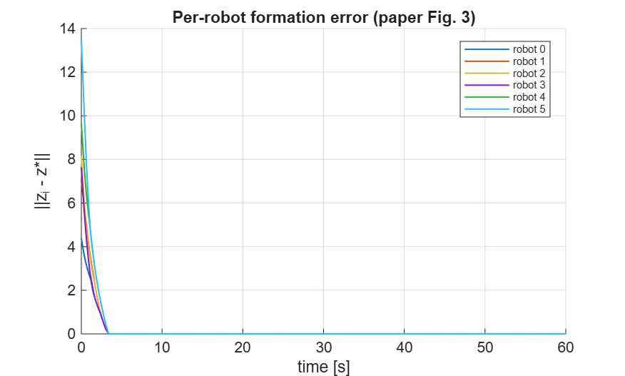

**α = 5**  (`fg_n6_a5_srcA_none`)

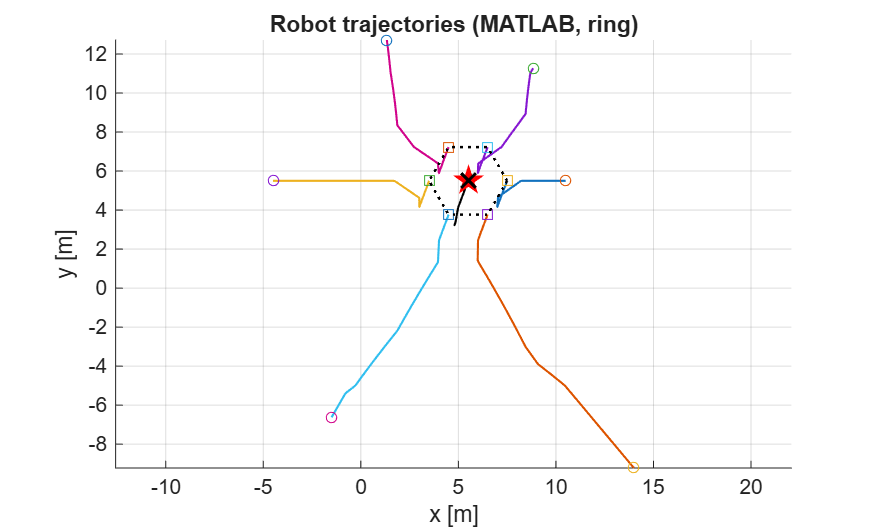

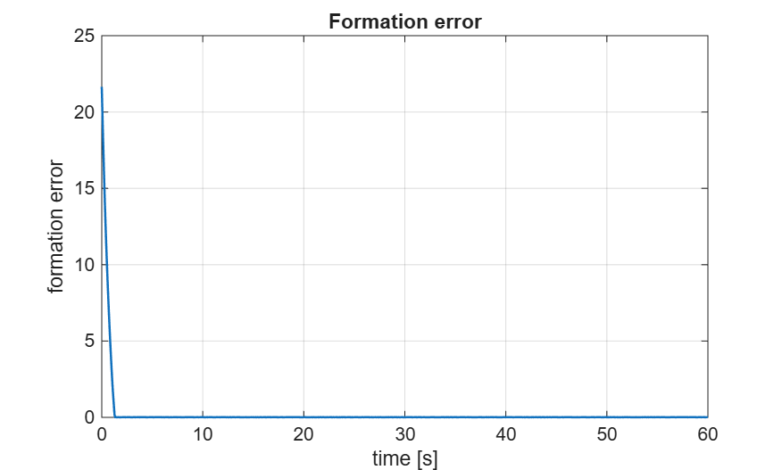 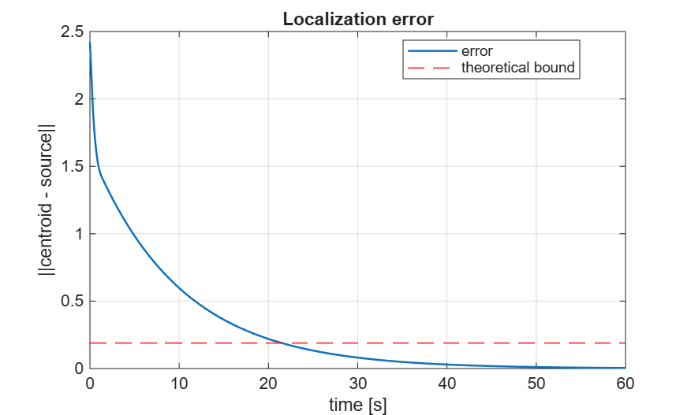


**α = 20**  (`fg_n6_a20_srcA_none`)


 


**α = 50**  (`fg_n6_a50_srcA_none`)


 


**α = 100**  (`fg_n6_a100_srcA_none`)


 


*Animations, α increasing left to right (source = red star, target circle dotted):*

    

### 6.2 TurtleBot-Simulink α sweep

The same five α values through the differential-drive Simulink model (boundary-layer `sat(·/0.2)`, unicycle feedback-linearization, offset r = 2, β = 0.05).


| α | α/β | formation entry [s] | final formation | final localization | max \|v\| [m/s] | inside ε? |
|---|---|---|---|---|---|---|
| 1 | 20 | 2.884 | 0.09425 | 0.0002142 | 9.804 | yes |
| 5 | 100 | 1.164 | 0.01944 | 0.0002508 | 19.92 | yes |
| 20 | 400 | 0.384 | 0.004889 | 0.0002962 | 49.92 | yes |
| 50 | 1000 | 0.168 | 0.09363 | 0.2679 | 107.1 | no |
| 100 | 2000 | 0.096 | 0.8665 | 0.001887 | 282.8 | yes |

Reading the sweep:

- **The 1/α formation law survives the vehicle model.** Formation entry tracks the single-integrator almost exactly (≈ 2.9 s at α = 1 down to ≈ 0.10 s at α = 100), so the finite-time mechanism carries through the feedback-linearization.
- **But accuracy is non-monotonic — there is an upper useful α.** α = 20 is the sweet spot (final formation ≈ 5×10⁻³). Beyond it the large gain excites the differential-drive / boundary-layer dynamics: α = 50 overshoots and leaves the ε bound (final localization ≈ 0.27 > ε = 0.19), and α = 100 degrades the circle (final formation ≈ 0.87).
- **Commanded speed explodes with α.** Peak \|v\| climbs from ≈ 10 m/s (α = 1) to ≈ 283 m/s (α = 100) — unphysical for a real TurtleBot, and the practical reason the main Simulink runs use α = 10. Unlike the ideal single-integrator, the real-vehicle model has a ceiling on useful formation gain.

*Per-run static plots, α increasing (each run's own trajectory, then its formation & localization error):*

**α = 1**  (`fgt_n6_a1_srcA_none`)


 

**α = 5**  (`fgt_n6_a5_srcA_none`)


 

**α = 20**  (`fgt_n6_a20_srcA_none`)


 

**α = 50**  (`fgt_n6_a50_srcA_none`)


 

**α = 100**  (`fgt_n6_a100_srcA_none`)


 

*Animations, α increasing left to right (source = red star, target circle dotted):*

    

### 6.3 Extreme localization gain: β = 10000 (Simulink)

Holding β = 10000 (vs the paper's 0.05) and sweeping α = 1, 10, 100 probes the opposite imbalance — localization gain overwhelming formation. Plots and summaries are saved; no gif (the trajectory scale is non-physical). The overlay is log-scale because the errors diverge.


| α | α/β | final formation | final localization | max \|v\| [m/s] | forms? |
|---|---|---|---|---|---|
| 1 | 0.0001 | 1.923e+08 | 1.089e+07 | 1.442e+06 | no (diverges) |
| 10 | 0.001 | 1.923e+08 | 1.094e+07 | 1.442e+06 | no (diverges) |
| 100 | 0.01 | 1.924e+08 | 1.073e+07 | 1.442e+06 | no (diverges) |

Reading the probe:

- **The swarm diverges regardless of α.** All three runs blow up to a formation error ≈ 1.9×10⁸ and a localization error ≈ 1.1×10⁷, nearly identical for α = 1, 10, 100: the localization term `(2β/R)·σ ≈ 1.4×10⁶` dwarfs the formation term (≤ 2α ≤ 200) by four-plus orders of magnitude, so α is irrelevant here.
- **Mechanism.** The huge push drives every robot outward at the saturation velocity \|v\| = (2β/R)·f_Dmax = 1.442×10⁶ m/s; they immediately leave `Dmax`, then all read the constant `f_Dmax` and keep accelerating outward in a fixed direction — neither formation nor localization ever begins.
- **Lesson.** β does not buy localization *speed* (the rate is `2βκ` only in the small-gain regime where formation stays intact); an oversized β destabilizes the whole system. The localization gain must stay small, as the paper's β = 0.05 does.

*Per-run static plots, α increasing (each run's own trajectory, then its formation & localization error):*

**α = 1**  (`fgb_n6_a1_srcA_none`)


 

**α = 10**  (`fgb_n6_a10_srcA_none`)


 

**α = 100**  (`fgb_n6_a100_srcA_none`)


 

## 7. Observations

- **Uninformed robots do not break localization.** Despite 1–3 blind robots (33–25 % of the swarm) that only ever report the saturation constant `f_Dmax = 144.2`, every run still forms the circle and drives the centroid to the source: single-integrator final localization 0.014–0.035, Simulink 2–9×10⁻⁴. The informed sub-swarm supplies enough gradient information to localize, exactly as Theorem 1 predicts for `n_𝒳 ≥ 1`.
- **The blind phase is real, then self-heals.** Every case starts with `min_n_informed = n − k` (3/4/5 for n = 4/6/8); as the circle contracts around the source the out-of-range robots cross back inside `Dmax`, so `final_n_informed = n`. The uninformed measurement branch (Eq. 2) is genuinely exercised during the transient.
- **ε inflates with the blind fraction, as the theorem says.** ε = 0.169 / 0.189 / 0.195 for n = 4 / 6 / 8 (vs the all-informed 0.1 = δ/κR), and every noise-free run lands inside its ε. The gaussian runs (unbounded noise, ε not formally applicable) land at essentially the same final error as their noise-free twins.
- **Source-independence is exact.** For every (mode, n, noise), source A [5.5,5.5] and source B [30,-20] produce identical error curves and metrics — the control law plus the source-relative initial layout are translation-invariant, so a far source localizes as well as the paper's.
- **Simulink noise is now real and reproducible.** With the seeded Random Number source, each gaussian Simulink run differs measurably from its noise-free twin (e.g. n=4 final localization 8.9×10⁻⁴ vs 2.0×10⁻⁴) yet stays fully convergent — and the differential-drive runs converge at ratio 200, below the sufficient bound for all n, reconfirming it is sufficient, not necessary.
- **Commanded velocities are large** (|v| ≈ 24–30 m/s, |ω| ≈ 13–18 rad/s) because the Simulink reference runs unsaturated with offset r = 2; these are ideal-actuator numbers, not TurtleBot3 hardware limits. Set `max_linear_velocity` / `max_angular_velocity` to clamp them.
- **The gain sweeps (§6) separate the two knobs.** α sets formation speed (∝ 1/α) in both models, but the differential-drive model has an upper useful α (past α ≈ 20 accuracy degrades and commanded speed explodes), whereas β must stay small — the β = 10000 probe diverges outright. This is why the main matrix uses large α with a small β.

## 8. Reproduction

```matlab
% from the repository root, with MATLAB + Simulink
addpath('outputs/batch_report');
run_batch('si_*');    % 12 single-integrator cases
run_batch('ts_*');    % 12 turtlebot_simulink cases
run_batch('fg_*');    % 5 single-integrator formation-gain sweep (n = 6)
run_batch('fgt_*');   % 5 turtlebot_simulink formation-gain sweep (n = 6)
run_batch('fgb_*');   % 3 extreme beta = 10000 probes (n = 6)
make_formation_gain_plot;   % 3 overlay figures + sweep_meta.json
```

Configs live in `outputs/batch_report/configs/*.json` (generated by `gen_configs.py`); each run writes its plots + `summary.json` under `outputs/batch_report/runs/<run_id>_{matlab,turtlebot}/`, and `run_batch.m` aggregates every summary into `batch_summary.json`. This report is regenerated from that file by `make_report.py`.
